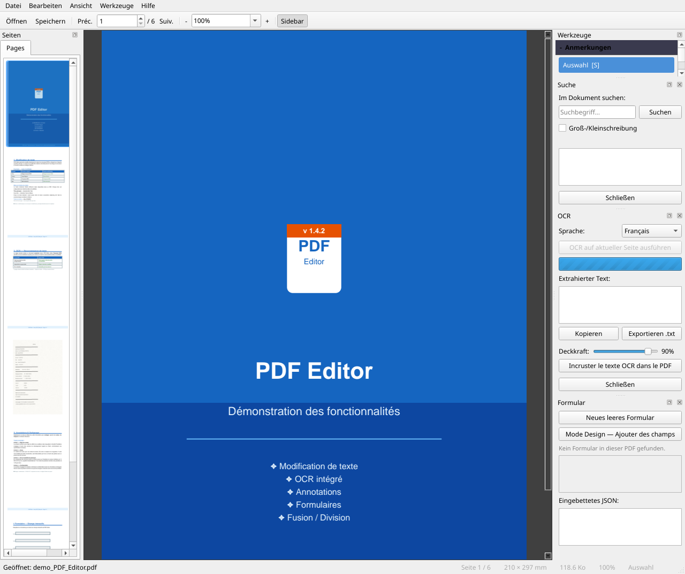
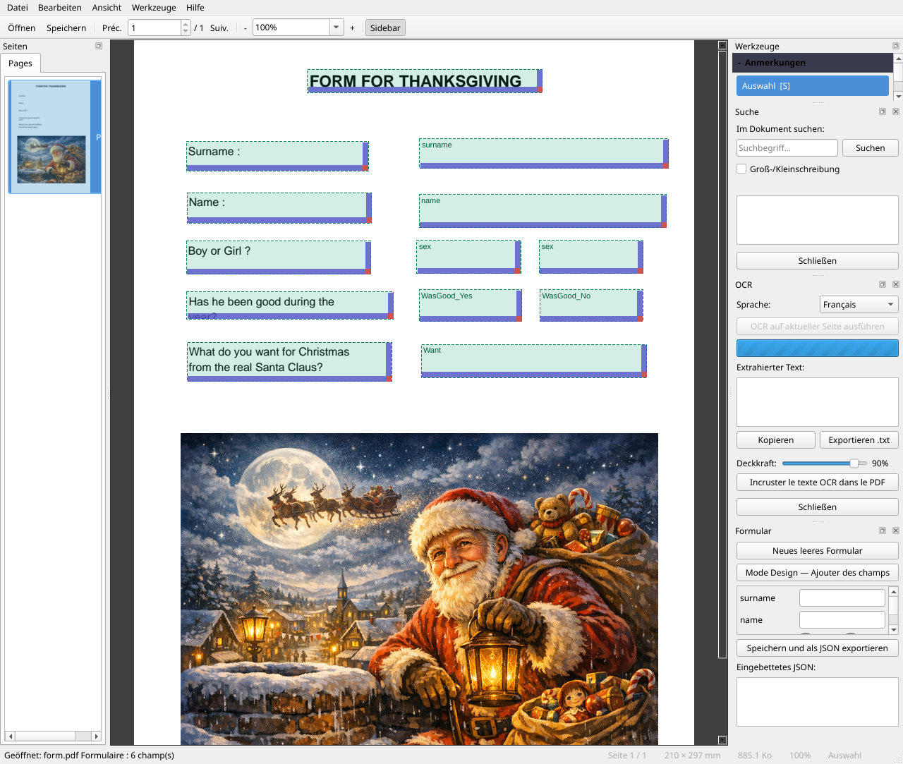
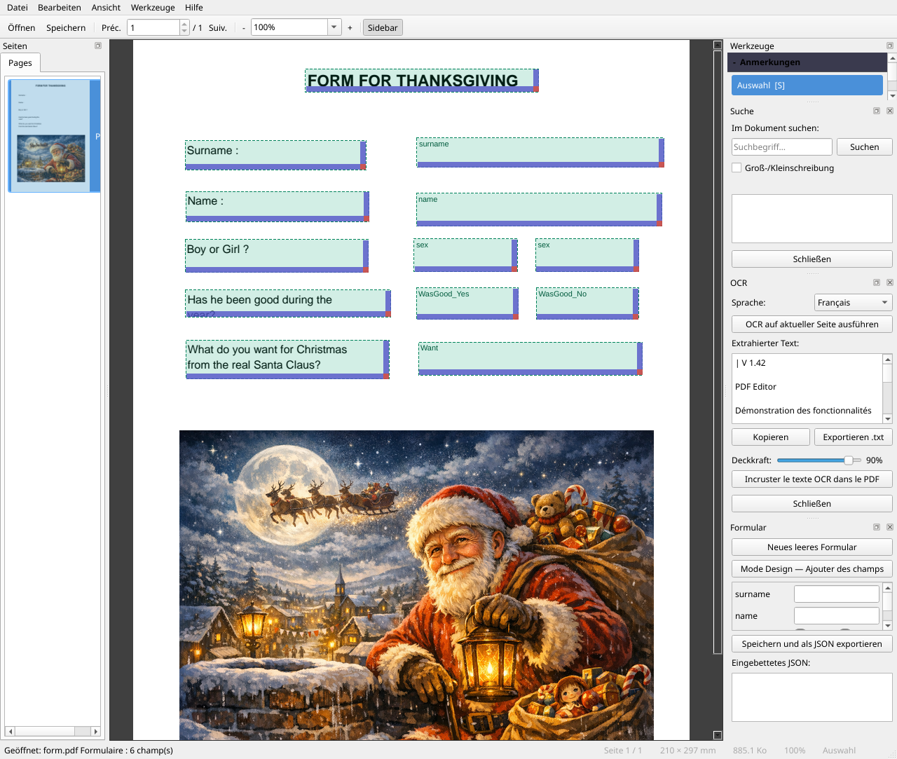
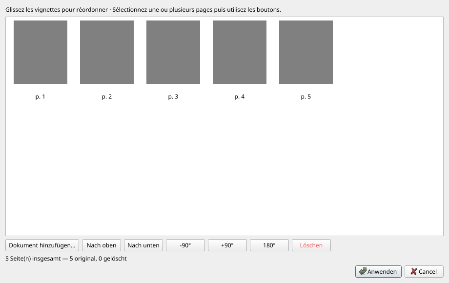
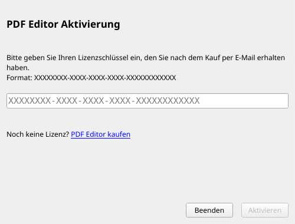
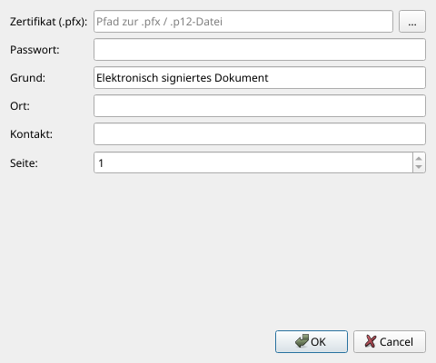

# Benutzerhandbuch — PDF Editor

**Version 1.5.8** · 01/07/2026

---

## Inhaltsverzeichnis

1. [Übersicht](#presentation)
2. [Installation und erster Start](#installation)
3. [Allgemeine Benutzeroberfläche](#interface)
4. [Einstellungen](#preferences)
5. [Dokument öffnen und schließen](#ouvrir)
6. [Im Dokument navigieren](#navigation)
7. [Zoom und Anzeige](#zoom)
8. [Vorhandenen Text bearbeiten](#modifier-texte)
9. [Text einfügen](#inserer-texte)
10. [Anmerkungen](#annotations)
11. [Bild einfügen](#inserer-image)
12. [PDF-Formulare](#formulaires)
13. [Optische Zeichenerkennung (OCR)](#ocr)
14. [Seitenverwaltung — Neu anordnen / Zusammenführen / Aufteilen](#pages)
15. [Kopf- und Fußzeilen](#entetes)
16. [Wasserzeichen](#filigrane)
17. [Textstempel](#tampon-texte)
18. [Bildstempel — Logo und Signatur](#tampon-image)
19. [Windows-Integration — Rechtsklick](#windows)
20. [Dokumentmetadaten](#metadata)
21. [PDF komprimieren](#compression)
22. [Passwortschutz](#protection)
23. [Digitale Signatur](#signature)
24. [Textsuche](#recherche)
25. [Inhalt extrahieren](#extraction)
26. [Dokument speichern](#enregistrer)
27. [Rückgängig / Wiederholen](#annuler)
28. [Designs und Sprache](#langue)
29. [Tastenkürzel](#raccourcis)

---

> **Neuheiten v1.5.8** : Menü **Werkzeuge** vollständig in Untermenüs organisiert (*Einfügen / Organisieren / Extrahieren / Schützen / OCR*) ; Modus **fortlaufender Bildlauf** (`Ctrl+Umschalt+C`) ; **inline-Suchleiste** ; zentralisiertes Menü **Einstellungen** (`Bearbeiten > Einstellungen`), das Sprache, Hilfe, Lizenz und Windows-Integration zusammenfasst.
>
> **v1.5.0** : Dialog **Einstellungen**, **Erscheinungsbild**, **Vollbild**, Seite duplizieren, kontinuierlicher Anzeigemodus, inline-Suche.
>
> **v1.4.1** : Kontextmenü **In PDF Editor zusammenführen** (Mehrfachauswahl von Dateien → vorgeladener Organisationsdialog) · überarbeiteter *Windows-Integration*-Dialog mit zwei separat aktivierbaren Abschnitten.
>
> **v1.4.0** : Navigation zur nächsten/vorherigen Seite über Bildlaufleiste und Mausrad · Textextraktion mit Seitenbereichsauswahl · Zusammenfassungs-Popup nach Extraktion · *Werkzeuge*-Panel an Menü Werkzeuge ausgerichtet · erweitertes *Über*.
>
> **v1.3.0** : Erweiterte Seitenleiste (Registerkarten *Sprache* und *Hilfe*) · Menü *Signatur* in *Werkzeuge* integriert · Symbole in allen Menüs · alle PDF-Operationen können rückgängig gemacht werden (`Ctrl+Z`).

---

<a name="presentation"></a>
## 1. Übersicht

**PDF Editor** ist ein kostenloser Open-Source-PDF-Editor, mit dem Sie folgende Aktionen ausführen können:

- PDF-Dateien lesen und darin navigieren
- Vorhandenen Text direkt im Dokument bearbeiten
- Text, Bilder und Anmerkungen einfügen
- PDF-Formulare erstellen und ausfüllen
- Optische Zeichenerkennung (OCR) auf gescannten Seiten anwenden
- Dokumente neu anordnen, zusammenführen und aufteilen
- Ein neues PDF aus Bildern zusammenstellen (JPG, PNG, TIFF…)
- Kopf- und Fußzeilen, Wasserzeichen und Stempel hinzufügen
- Metadaten bearbeiten und die Datei komprimieren
- Dokumente mit einem Passwort schützen
- Mit einem `.pfx`-Zertifikat digital signieren

---

<a name="installation"></a>
## 2. Installation und erster Start

### Portable Anwendung

Die Anwendung erfordert keine Installation. Doppelklicken Sie auf `PDFEditor.exe`, um sie direkt zu starten.

### Installation mit Setup

Falls Sie über `PDFEditor-Setup.exe` verfügen, starten Sie ihn und folgen Sie dem Assistenten.
Ein Schritt bietet die automatische Installation von **Tesseract OCR** (erforderlich für die Zeichenerkennung).

Der Installer bietet außerdem an, **PDF Editor als Standardanwendung** für PDF-Dateien festzulegen (standardmäßig aktiviert).

### Erster Start — Tesseract OCR

Beim ersten Start, wenn Tesseract auf Ihrem Rechner nicht erkannt wird, öffnet sich ein Fenster, das den automatischen Download und die Installation anbietet (~50 MB).

- **OCR-Sprache** : Wählen Sie die Hauptsprache Ihrer Dokumente (das System erkennt automatisch die Windows-Sprache).
- **Englisch** ist immer als Fallback-Sprache enthalten.
- Sie können die Installation ablehnen; die OCR-Funktion ist dann lediglich nicht verfügbar, bis Tesseract manuell installiert wird.

---

<a name="interface"></a>
## 3. Allgemeine Benutzeroberfläche




```
┌──────────────────────────────────────────────────────────────────────┐
│  Menü  (Datei · Bearbeiten · Ansicht · Werkzeuge · Hilfe)       │
├──────────────────────────────────────────────────────────────────────┤
│  Hauptleiste  (◀ Zurück | Seite / Total | Weiter ▶ | Zoom)      │
├──────────────────────────────────────────────────────────────────────┤
│  Seitenleiste  (Neu anordnen/Zusammenführen · Aufteilen · Löschen …) │
├──────────────────────────────────────────────────────────────────────┤
│  Anmerkungsleiste  (Auswahl · Text · Hervorheben · …)           │
├──────────────────────┬───────────────────────────────────────────────┤
│                      │                                          │
│  Seitenleiste        │         PDF-Betrachter                   │
│  [Seiten]            │         (aktuelle Seite)                 │
│  [Werkzeuge]         │                                          │
│                      │          — oder —                        │
│                      │                                          │
│                      │         Kontinuierlicher Bildlauf        │
│                      │         (vertikales Scrollen)            │
│                      │                                          │
├──────────────────────┴───────────────────────────────────────────────┤
│  Statusleiste                                                    │
└──────────────────────────────────────────────────────────────────────┘
```

- **Linke Seitenleiste** : Zwei Registerkarten — *Seiten* und *Werkzeuge*. Mit `F4` ein-/ausblenden.
- **Betrachter** : Standardmäßig einzelne Seite oder Modus *fortlaufender Bildlauf* (`Ansicht → Fortlaufender Bildlauf`, `Ctrl+Umschalt+C`).
- **Suchleiste** : Erscheint oben im Lesebereich (`Ctrl+F`) und schließt sich mit `Esc`.
- **Statusleiste** : Kontextnachrichten, Seitenzahl, Hinweis auf nicht gespeicherte Änderungen (`*`).

### Registerkarten der Seitenleiste

| Registerkarte | Inhalt |
|--------|---------|
| **Seiten** | Navigationsminiaturen — Klicken Sie, um zu einer Seite zu springen |
| **Werkzeuge** | Abschnitt *Werkzeuge* (gleiche Reihenfolge wie im Menü) · Abschnitt *Anmerkungen* · Abschnitt *Tastenkürzel* |

### Menüs der oberen Leiste

| Menü | Hauptinhalt |
|------|------------|
| **Datei** | Öffnen, Speichern, Drucken, Beenden |
| **Bearbeiten** | Rückgängig, Wiederholen, Suchen, **Einstellungen** |
| **Ansicht** | Zoom, Bereich, Fortlaufender Bildlauf, Vollbild, Design, Erscheinungsbild |
| **Werkzeuge** | Aktionen in Untermenüs gruppiert: *Einfügen*, *Organisieren*, *Extrahieren*, *Schützen*, *OCR* |
| **Hilfe** | Handbuch, Tastenkürzel, Fehler melden, Auf Updates prüfen, Über |

> Sprache, Lizenz, Windows-Integration und Erscheinungsbild sind nun in **Bearbeiten > Einstellungen** zentralisiert.

---

<a name="preferences"></a>
## 4. Einstellungen

Alle Anwendungseinstellungen sind in einem einzigen Dialog unter **Bearbeiten → Einstellungen** (`Ctrl+,`) zusammengefasst:

| Registerkarte | Inhalt |
|--------|---------|
| **Sprache** | Auswahl der Oberflächensprache (Neustart vorgeschlagen) |
| **Hilfe und Tastenkürzel** | Zugriff auf das Handbuch und Übersicht der Tastenkürzel |
| **Lizenz und Integration** | Lizenzverwaltung, Windows-Integration (Rechtsklick) |
| **Erscheinungsbild** | Anpassung von Design und Farben |

> Sprache, Hilfe und Windows-Integration befinden sich nicht mehr in separaten Registerkarten der Seitenleiste — sie sind hier zu finden.

---

<a name="ouvrir"></a>
## 5. Dokument öffnen und schließen

| Aktion | Methode |
|--------|---------|
| PDF öffnen | *Datei → 📂 Öffnen…* oder `Ctrl+O` |
| Aus Explorer öffnen | Datei per Drag & Drop auf das Fenster ziehen |
| In Kommandozeile öffnen | `PDFEditor.exe mein_dokument.pdf` |
| Dokument schließen | *Datei → ✖ Schließen* oder `Ctrl+W` |

Wenn das Dokument nicht gespeicherte Änderungen enthält, wird vor dem Schließen eine Bestätigung angefordert.

### Passwortgeschützte Dokumente

Beim Öffnen einer verschlüsselten Datei fragt ein Dialog nach dem Benutzerpasswort. Für den Zugriff auf erweiterte Bearbeitungsoptionen kann das **Besitzerpasswort** erforderlich sein.

---

<a name="navigation"></a>
## 6. Im Dokument navigieren

| Aktion | Methode |
|--------|---------|
| Nächste Seite | Klick auf **Weiter ▶** oder Taste `→` |
| Vorherige Seite | Klick auf **◀ Zurück** oder Taste `←` |
| Zu einer bestimmten Seite springen | Nummer eingeben und `Eingabe` drücken |
| Auf der Seite scrollen | Mausrad oder rechte Bildlaufleiste |
| Nächste Seite (Mausrad) | Mausrad nach unten am **Seitenende** |
| Vorherige Seite (Mausrad) | Mausrad nach oben am **Seitenanfang** |
| Nächste Seite (Bildlaufleiste) | Bildlaufleiste ganz nach unten ziehen |
| Auf eine Miniatur klicken | Linke Seitenleiste — Registerkarte *Seiten* |
| **Fortlaufender Bildlauf** | `Ansicht → Fortlaufender Bildlauf` oder `Ctrl+Umschalt+C` |
| Doppelklick im kontinuierlichen Modus | Zurück zur Einzelseitenansicht an der geklickten Seite |

---

<a name="zoom"></a>
## 7. Zoom und Anzeige

| Aktion | Methode |
|--------|---------|
| Vergrößern | `Ctrl+=` oder Schaltfläche **+** |
| Verkleinern | `Ctrl+-` oder Schaltfläche **−** |
| Seite anpassen | `Ctrl+0` |
| Breite anpassen | `Ctrl+1` |
| Benutzerdefinierter Zoom | Prozentsatz in Dropdown eingeben |
| Zoom mit Maus | `Ctrl + Mausrad` |

---

<a name="modifier-texte"></a>
## 8. Vorhandenen Text bearbeiten


PDF Editor ermöglicht die Bearbeitung von Text direkt im Dokumentfluss.

### Schritte

1. Wählen Sie in der Anmerkungsleiste das Werkzeug **Text bearbeiten** (`T`).
2. **Doppelklicken** Sie auf das zu bearbeitende Wort oder den Textblock.
3. Ein Kontextfenster mit dem Text und Formatierungsoptionen erscheint:
   - Schriftart, Größe, **Fett**, *Kursiv*, Farbe, Zeichenabstand
   - Hintergrundfarbe (standardmäßig transparent)
4. Bearbeiten Sie den Text, passen Sie die Formatierung an und klicken Sie auf **Bestätigen** (`Ctrl+Eingabe`).

> **Tipp** : Das Werkzeug versucht zunächst eine Bearbeitung **direkt im PDF-Fluss**. Falls dies nicht möglich ist (unbekannte Schriftart, Bildtext), wechselt es zu einer Ersatzanmerkung.
>
> Falls die Änderung wirklich nicht angewendet werden kann (nicht bearbeitbare Schriftart, Bildtext, leerer Block, Fehler beim Einfügen in den Fluss), wird eine **persistente Meldung** in der **Statusleiste** unten im Fenster angezeigt (z. B.: *„Bearbeitung nicht möglich: Direktbearbeitung fehlgeschlagen…"*).

### Rückgängig

`Ctrl+Z` zum Rückgängigmachen · `Ctrl+Y` zum Wiederholen (siehe [§27 Rückgängig / Wiederholen](#annuler)).

---

<a name="inserer-texte"></a>
## 9. Text einfügen

Um einen neuen Textblock auf einer leeren Fläche hinzuzufügen:

1. Wählen Sie das Werkzeug **Text bearbeiten** (`T`).
2. **Doppelklicken** Sie auf eine leere Stelle der Seite.
3. Das Kontextfenster öffnet sich mit einem leeren Editor.
4. Geben Sie Ihren Text ein, wählen Sie die Formatierung und bestätigen Sie.

Der Text wird als dauerhafte **FreeText-Anmerkung** im PDF eingefügt.

---

<a name="annotations"></a>
## 10. Anmerkungen

Die Anmerkungsleiste bietet mehrere Werkzeuge:

| Werkzeug | Tastenkürzel | Verwendung |
|-------|-----------|-------|
| Auswahl | `S` | Vorhandene Anmerkungen auswählen und verschieben |
| Text bearbeiten | `T` | Dokumenttext bearbeiten (siehe §8 und §9) |
| Hervorheben | `H` | Wort oder Auswahl gelb hervorheben |
| Kommentar | `C` | Notiz (Sprechblase) auf der Seite hinzufügen |
| Bild | `I` | Bild einfügen (siehe §11) |
| Löschen | `E` | Anmerkung durch Klicken darauf löschen |

Dieselben Werkzeuge sind über die Registerkarte **Werkzeuge** der linken Seitenleiste im Abschnitt *Anmerkungen* erreichbar (standardmäßig reduziert — zum Aufklappen klicken).

### Strichstärke

Im Panel *Werkzeuge → Anmerkungen* regelt das Feld **Stärke** die Strichstärke von Zeichenanmerkungen (0,5 bis 10 pt).

### Anmerkung skalieren / verschieben

Im Modus **Auswahl** (`S`):
- **Klicken** Sie auf eine Anmerkung, um sie auszuwählen (Griffe sichtbar).
- **Ziehen** Sie, um sie zu verschieben · **Ziehen eines Griffs**, um die Größe zu ändern.
- Taste `Entf`, um die ausgewählte Anmerkung zu löschen.

---

<a name="inserer-image"></a>
## 11. Bild einfügen

**Methode 1 — Menü**
1. *Werkzeuge → Einfügen → 🖼 Bild einfügen…*
2. Wählen Sie die Bilddatei (PNG, JPEG, BMP, WebP…).
3. Zeichnen Sie den Zielbereich auf der Seite.

**Methode 2 — Werkzeugleiste**
1. Klicken Sie in der Leiste *Seiten & Formular* auf **🖼 Bild einfügen**.
2. Dasselbe Verfahren.

**Methode 3 — Werkzeuge-Panel**
1. Registerkarte **Werkzeuge** der Seitenleiste → *🖼 Bild einfügen…*

Das Bild wird dauerhaft in das PDF eingebettet.

---

<a name="formulaires"></a>
## 12. PDF-Formulare




### Design-Modus aktivieren

Klicken Sie in der Leiste *Seiten & Formular* auf **✏ Design-Modus**.
Im Design-Modus erzeugt Klicken-Ziehen auf der Seite ein neues Feld.

### Verfügbare Feldtypen

| Typ | Beschreibung |
|------|-------------|
| Text | Freies Eingabefeld |
| Kontrollkästchen | Ja / Nein |
| Dropdown-Liste | Auswahl vordefinierter Optionen |
| Optionsfelder | Ausschlusssauswahl in einer Gruppe |
| Beschriftung | Statischer, nicht bearbeitbarer Text |

### Formular ausfüllen

Im normalen Modus (Design deaktiviert) klicken Sie auf ein Feld, um es auszufüllen.
Die Seitenleiste listet alle Felder mit ihren Werten auf.

### Feld verschieben

*Werkzeuge → Textblock verschieben* (`M`) und dann das Feld ziehen.

---

<a name="ocr"></a>
## 13. Optische Zeichenerkennung (OCR)




**Voraussetzung** : Tesseract OCR ist installiert (siehe [§2](#installation)). In der installierten Windows-Version ist Tesseract enthalten.

### OCR starten

1. *Werkzeuge → OCR → 🔤 Zeichenerkennung (OCR)…*
2. Das OCR-Panel öffnet sich rechts.
3. Wählen Sie die **Sprache** des Dokuments.
4. Klicken Sie auf **OCR ausführen**.

### Ergebnis

- Der erkannte Text wird mit farbigen Blöcken überlagert angezeigt.
- Passen Sie Größe/Position jedes Blocks per Drag & Drop an.
- Klicken Sie auf **In PDF einbetten**, um den Text dauerhaft zu machen.

> Die eingebetteten OCR-Blöcke sind auf dem Bildschirm unsichtbar, aber von PDF-Readern indizierbar (`Ctrl+F`, Kopieren-Einfügen…).

### Zusätzliche OCR-Optionen

| Option | Beschreibung |
|--------|-------------|
| *Werkzeuge → OCR → Seite mit nativem Text neu aufbauen* | Ersetzt Textelemente der Seite durch nativen PDF-Text (bessere Bearbeitungsqualität). |
| *Werkzeuge → OCR → Korrektur als Bild-Patch anwenden* | Korrigiert OCR-Text durch direkte Änderung des Seitenbilds (experimentell). |

### OCR-Zeile mit Doppelklick korrigieren

In einem gescannten PDF, das bereits eine OCR-Ebene enthält (z. B. nach Klick auf **In PDF einbetten**), können Sie eine Zeile direkt im Betrachter korrigieren:

1. Stellen Sie sicher, dass das aktive Werkzeug **Text bearbeiten** (`T`) oder **Auswahl** (`S`) ist.
2. **Doppelklicken** Sie auf die zu korrigierende gescannte Zeile.
3. Ein **inline**-Bearbeitungsfeld (ohne Popup-Fenster) erscheint anstelle der Zeile.
4. Korrigieren Sie den Text.
5. Drücken Sie `Eingabe`, um zu bestätigen, oder `Esc`, um abzubrechen.

> Die Korrektur wird als unsichtbare OCR-Anmerkung gespeichert, indiziert durch die Suche (`Ctrl+F`) und Kopieren-Einfügen. Diese Operation ist **rückgängig** via `Ctrl+Z`.

> **Tipp** : Der Doppelklick ist die schnellste Möglichkeit, einen Tippfehler in einem Scan zu korrigieren. Wenn die Zeile beim Klick nicht erkannt wird, starten Sie zunächst *Werkzeuge → OCR → Zeichenerkennung (OCR)…* und klicken Sie auf **In PDF einbetten**.

---

<a name="pages"></a>
## 14. Seitenverwaltung — Neu anordnen / Zusammenführen / Aufteilen




### Seiten neu anordnen und zusammenführen

*Werkzeuge → Organisieren → ⊕ Seiten neu anordnen/zusammenführen…* (oder Schaltfläche **⊕ Neu anordnen/Zusammenführen** in der Leiste)

Dieses vielseitige Werkzeug funktioniert **mit oder ohne geöffnetes Dokument**:

| Situation | Ergebnis |
|-----------|----------|
| PDF geöffnet | Seiten des aktuellen Dokuments neu anordnen |
| Kein PDF geöffnet | Neues PDF von Grund auf erstellen |

#### Oberfläche des Organisators

- Die Seiten werden als **Miniaturen** angezeigt, die per Drag & Drop neu angeordnet werden können.
- Wählen Sie eine oder mehrere Miniaturen aus und verwenden Sie die Schaltflächen:

| Schaltfläche | Aktion |
|--------|--------|
| ▲ Nach oben / ▼ Nach unten | Auswahl verschieben |
| ↺ -90° / ↻ +90° / ↕ 180° | Ausgewählte Seiten drehen |
| 🗑 Löschen | Ausgewählte Seiten entfernen |
| ➕ Dokument hinzufügen… | Seiten aus einem anderen Dokument einfügen |

#### Dokument hinzufügen

Die Schaltfläche **➕ Dokument hinzufügen…** akzeptiert:
- **PDF** — alle Seiten werden hinzugefügt
- **Bilder** : JPG, JPEG, PNG, BMP, TIFF (auch mehrseitig), WebP — jedes Bild wird zu einer Seite

> **Tipp** : Um mehrere PDFs **zusammenzuführen**, öffnen Sie den Organisator ohne geöffnetes Dokument, fügen Sie Ihre Dateien über „Dokument hinzufügen" hinzu, ordnen Sie sie an und klicken Sie auf **Anwenden** — „Speichern unter" fragt nach dem Namen des neuen PDFs.

> Diese Operation ist **rückgängig** via `Ctrl+Z`.

### Aktuelle Seite duplizieren

*Werkzeuge → Organisieren → Aktuelle Seite duplizieren* oder `Ctrl+Umschalt+P`.

> Diese Operation ist **rückgängig** via `Ctrl+Z`.

### Aktuelle Seite löschen

*Werkzeuge → Organisieren → 🗑 Aktuelle Seite löschen* oder `Ctrl+Entf`.

> Diese Operation ist **rückgängig** via `Ctrl+Z`.

### Schnelle Drehung der aktuellen Seite

| Aktion | Methode |
|--------|---------|
| +90° drehen | *Werkzeuge → Organisieren → ↻ Seite drehen (+90°)* oder `R` |
| -90° drehen | *Werkzeuge → Organisieren → ↺ Seite drehen (-90°)* oder `Umschalt+R` |

### Dieses PDF aufteilen

1. *Werkzeuge → Organisieren → ✂ Dieses PDF aufteilen…*
2. Geben Sie die Anzahl der **Seiten pro Datei** an (z. B. `1` = eine Datei pro Seite, `5` = Gruppen von 5 Seiten).
3. Eine Vorschau zeigt die Anzahl der zu erstellenden Dateien.
4. Wählen Sie den Zielordner und bestätigen Sie.

---

<a name="entetes"></a>
## 15. Kopf- und Fußzeilen

*Werkzeuge → ☰ Kopf- und Fußzeilen…*

Fügt automatischen Text oben und/oder unten auf jeder Seite hinzu.

### Textbereiche

Jeder Bereich (Kopf- und Fußzeile) umfasst drei Spalten: **Links · Mitte · Rechts**.

### Dynamische Tokens

Fügen Sie Variablen ein, die beim Anwenden automatisch ersetzt werden:

| Token | Eingefügter Wert |
|-------|---------------|
| `{page}` | Seitennummer der aktuellen Seite |
| `{total}` | Gesamtseitenzahl |
| `{date}` | Aktuelles Datum (TT/MM/JJJJ) |

Schaltflächen unter jedem Feld ermöglichen das Einfügen dieser Tokens per Klick.

### Gemeinsame Optionen

| Option | Beschreibung |
|--------|-------------|
| Schriftgröße | 6 bis 36 pt |
| Farbe | Schwarz, Grau, Rot, Blau |
| Abstand vom Rand | Abstand in mm vom Seitenrand |
| Nicht auf der 1. Seite anwenden | Nützlich für Deckblätter |

### Bearbeiten oder entfernen

Öffnen Sie erneut *Werkzeuge → ☰ Kopf- und Fußzeilen…*: Die zuletzt verwendeten Einstellungen werden neu geladen.
- **Bearbeiten** : Ändern Sie die Texte und klicken Sie erneut auf **Anwenden** — die alten Kopfzeilen werden ersetzt.
- **Entfernen** : Leeren Sie alle Felder und klicken Sie auf **Anwenden** — Kopf-/Fußzeilen werden gelöscht.

> Diese Operation ist **rückgängig** via `Ctrl+Z`.

---

<a name="filigrane"></a>
## 16. Wasserzeichen

*Werkzeuge → ◈ Wasserzeichen…*

Fügt einen diagonalen Text auf allen Seiten des Dokuments ein.

| Option | Beschreibung |
|--------|-------------|
| Text | Wasserzeichentext (z. B. `VERTRAULICH`) |
| Größe | 10 bis 150 pt |
| Farbe | Grau, Rot, Blau, Grün, Schwarz |
| Deckkraft | 5 % (sehr transparent) bis 100 % (deckend) |

> Das Wasserzeichen ist in den PDF-Inhalt integriert — es erscheint beim Drucken.

> Diese Operation ist **rückgängig** via `Ctrl+Z`.

---

<a name="tampon-texte"></a>
## 17. Textstempel

*Werkzeuge → Einfügen → 🖊 Textstempel…*

Fügt einen Stempel im Stil eines „Stempelabdrucks" (eingerahmter Text) auf einer oder mehreren Seiten ein.

### Verfügbare Stempel

| Stempel | Farbe |
|--------|--------|
| GENEHMIGT | Grün |
| ABGELEHNT | Rot |
| ZU UNTERZEICHNEN | Blau |
| VERTRAULICH | Rot |
| ENTWURF | Grau |
| DRINGEND | Orange |
| KOPIE | Grau |
| ZU ÜBERARBEITEN | Orange |
| Benutzerdefiniert… | Freie Wahl (freier Text) |

### Optionen

| Option | Beschreibung |
|--------|-------------|
| Position | Oben rechts, Oben links, Unten rechts, Unten links, Mitte |
| Seiten | Alle Seiten, Erste Seite, Letzte Seite |
| Drehung | Horizontal (0°) oder Diagonal (−45°) |
| Deckkraft | 10 % bis 100 % |

Eine **Live-Vorschau** wird rechts im Dialog angezeigt.

> Diese Operation ist **rückgängig** via `Ctrl+Z`.

---

<a name="tampon-image"></a>
## 18. Bildstempel — Logo und Signatur

*Werkzeuge → Einfügen → 🖼 Bildstempel…*

Fügt ein Bild (Firmenlogo, gescannte Signatur, Stempel…) auf einer oder mehreren Seiten ein. Hinzugefügte Stempel werden **sitzungsübergreifend** in einer persönlichen Bibliothek gespeichert.

### Stempelbibliothek

Die Bibliothek wird in `~/.pdf_editor/stamps/` gespeichert. Sie ist beim ersten Start leer.

| Schaltfläche | Aktion |
|--------|--------|
| ➕ Hinzufügen… | Bild importieren (PNG, JPG, BMP, WebP, TIFF) und benennen |
| 🗑 Löschen | Ausgewählten Stempel aus der Bibliothek entfernen |

### Optionen

| Option | Beschreibung |
|--------|-------------|
| Position | Unten rechts, Unten links, Oben rechts, Oben links, Mitte |
| Seiten | Alle Seiten, Erste Seite, Letzte Seite |
| Größe | Prozentsatz der Seitenbreite (5 % bis 100 %) |
| Deckkraft | 10 % bis 100 % |

> **Transparenz** : PNG-Bilder mit transparentem Hintergrund (Signaturen, Logos) behalten ihre Transparenz im PDF bei.

Eine **Live-Vorschau** wird rechts im Dialog angezeigt.

> Diese Operation ist **rückgängig** via `Ctrl+Z`.

---

<a name="windows"></a>
## 19. Windows-Integration — Rechtsklick




*Bearbeiten → Einstellungen → Lizenz und Integration → Windows-Integration (Rechtsklick)…*

PDF Editor bietet zwei Einträge im Kontextmenü des Windows-Explorers, die beim ersten Start **automatisch aktiviert** werden. Sie werden über *Bearbeiten → Einstellungen → Lizenz und Integration* verwaltet.

### Kontextmenü-Einträge

| Eintrag | Aktion |
|--------|--------|
| **Mit PDF Editor öffnen** | Öffnet die ausgewählte Datei in der Anwendung. |
| **In PDF Editor zusammenführen** | Mehrfachauswahl von Dateien → öffnet den vorgeladenen Organisationsdialog mit den ausgewählten PDFs zum Zusammenführen. |

### Bild in PDF umwandeln

Wandelt eine Bilddatei per Rechtsklick in ein PDF um (Hintergrundverarbeitung, keine Oberfläche).

**Verwendung**

1. Rechtsklick auf eine Bilddatei im Explorer.
2. Wählen Sie **In PDF umwandeln - PDF EDITOR**.
3. Das PDF wird im **gleichen Ordner** mit dem gleichen Basisnamen (`.pdf`) erstellt.
4. Eine Bestätigung wird am Ende angezeigt.

**Formate** : JPG · JPEG · PNG · BMP · TIFF · TIF · WebP

> Falls bereits ein PDF mit gleichem Namen existiert, wird ein numerisches Suffix angehängt (`datei_1.pdf`, `datei_2.pdf`…).

---

### Dateien in PDF Editor zusammenführen

Öffnet den Dialog **Neu anordnen/Zusammenführen** mit mehreren vorgeladenen Dateien. Ideal, um PDFs und/oder Bilder schnell zu einem Dokument zusammenzufassen.

**Verwendung**

1. Wählen Sie im Windows-Explorer **mehrere Dateien** aus (`Ctrl`+Klick oder `Umschalt`+Klick).
2. Klicken Sie mit der **rechten Maustaste** auf die Auswahl.
3. Wählen Sie **In PDF Editor zusammenführen**.
4. PDF Editor öffnet sich und zeigt den Organisationsdialog mit allen vorgeladenen Dateien als Miniaturen.
5. Ordnen Sie die Seiten nach Bedarf an, klicken Sie auf **Anwenden** und speichern Sie.

**Kompatible Formate** : PDF · JPG · JPEG · PNG · BMP · TIFF · TIF · WebP

> Der Eintrag erscheint auch beim Rechtsklick auf eine einzelne kompatible Datei.
> Die Bilder werden automatisch in temporäre PDFs umgewandelt, bevor sie im Dialog angezeigt werden.

---

<a name="metadata"></a>
## 20. Dokumentmetadaten

*Werkzeuge → ℹ Metadaten…*

Zeigen Sie die im PDF gespeicherten Informationen an und bearbeiten Sie sie:

| Feld | Beschreibung |
|-------|-------------|
| Titel | Dokumenttitel |
| Autor | Name des Autors |
| Betreff | Thema oder kurze Beschreibung |
| Schlüsselwörter | Durch Kommas getrennte Schlüsselwörter |
| Anwendung | Software, mit der das Dokument erstellt wurde |

Diese Metadaten sind in den Dateieigenschaften sichtbar (Windows-Explorer, PDF-Reader).

> Diese Operation ist **rückgängig** via `Ctrl+Z`.

---

<a name="compression"></a>
## 21. PDF komprimieren

*Werkzeuge → ⚡ PDF komprimieren*

Verringert die Dateigröße durch Optimieren der internen PDF-Ströme (Komprimierung von Objekten und Rekomprimierung vorhandener Daten).

- Die Komprimierung wird **sofort** auf das geöffnete Dokument angewendet.
- Eine Meldung unten auf dem Bildschirm zeigt die erzielte Reduzierung (in KB oder MB).
- Speichern Sie (`Ctrl+S`), um das Ergebnis zu behalten.

> Der Effekt ist bei nicht optimierten PDFs stärker sichtbar (Word-Exporte, Scans…). Bereits komprimierte PDFs zeigen kaum Unterschiede.

> Diese Operation ist **rückgängig** via `Ctrl+Z`.

---

<a name="protection"></a>
## 22. Passwortschutz

### Dokument schützen

1. *Werkzeuge → Schützen → 🔒 Mit Passwort schützen…*
2. Geben Sie ein **Benutzerpasswort** (Lesen) und/oder **Besitzerpasswort** (Bearbeiten) ein.
3. Bestätigen Sie — das Dokument wird verschlüsselt und in einer neuen Datei gespeichert.

### Schutz entfernen

1. Öffnen Sie das Dokument mit dem Besitzerpasswort.
2. *Werkzeuge → Schützen → 🔓 Schutz entfernen…*
3. Der Schutz wird entfernt und in einer neuen Datei gespeichert.

---

<a name="signature"></a>
## 23. Digitale Signatur




PDF Editor ermöglicht das Signieren eines Dokuments mit einem digitalen `.pfx` / `.p12`-Zertifikat.

### Zugriff

- Über das Menü: *Werkzeuge → Schützen → ✍ Dokument signieren…*
- Über die Seitenleiste: Registerkarte **Werkzeuge** → *✍ Dokument signieren…*

### Signieren

1. *Werkzeuge → Schützen → ✍ Dokument signieren…*
2. Geben Sie an:
   - **Pfad zum Zertifikat** : `.pfx`- oder `.p12`-Datei
   - **Passwort** des Zertifikats
   - **Grund** und **Ort** (optional)
   - **Seite**, auf der die sichtbare Signatur platziert werden soll
3. Klicken Sie auf **OK**.

### Signaturen prüfen

*Werkzeuge → Schützen → 🔎 Signaturen prüfen…* (oder Schaltfläche *🔎 Signaturen prüfen…* im Werkzeuge-Panel) zeigt die Liste der Signaturen und ihren Gültigkeitsstatus.

### `.pfx`-Zertifikat erhalten

*Hilfe → 🔑 Wie erhält man ein .pfx-Zertifikat?* erklärt die Optionen:
- Zertifikat von einer Zertifizierungsstelle (Certum, Sectigo, GlobalSign…)
- Selbstsigniertes Zertifikat mit OpenSSL (nur interne Verwendung)

---

<a name="recherche"></a>
## 24. Textsuche

1. *Bearbeiten → 🔍 Suchen…* oder `Ctrl+F`.
2. Eine **inline-Suchleiste** erscheint oben im Betrachter.
3. Geben Sie den Suchbegriff ein.
4. Die Vorkommen werden hervorgehoben; verwenden Sie **Vorheriger / Nächster**, um zu navigieren.
5. Drücken Sie `Esc` oder klicken Sie auf ✕, um die Leiste zu schließen.

---

<a name="extraction"></a>
## 25. Inhalt extrahieren

### Text extrahieren

*Werkzeuge → Extrahieren → 📄 Text extrahieren…* (oder Schaltfläche im *Werkzeuge*-Panel)

Ein Dialog ermöglicht die Auswahl der zu extrahierenden Seiten:

| Option | Beschreibung |
|--------|-------------|
| **Alle Seiten** | Extrahiert Text aus dem gesamten Dokument |
| **Aktuelle Seite (N)** | Extrahiert nur die angezeigte Seite |
| **Bereich** | Seitenbereich *Von Seite X bis Y* eingeben |

Nach Bestätigung der Zieldatei wird eine **Zusammenfassung** angezeigt:
- Extrahierte Seiten
- Anzahl Zeichen, Wörter und Zeilen
- Größe der generierten Datei

### Bilder extrahieren

*Werkzeuge → Extrahieren → 🖼 Bilder extrahieren…* → Zielordner wählen.

Alle im PDF eingebetteten Bilder werden in den gewählten Ordner extrahiert.

---

<a name="enregistrer"></a>
## 26. Dokument speichern

| Aktion | Tastenkürzel |
|--------|-----------|
| Speichern | `Ctrl+S` |
| Speichern unter… | `Ctrl+Umschalt+S` |

> Der Fenstertitel zeigt ein Sternchen `*`, wenn das Dokument nicht gespeicherte Änderungen enthält.

---

<a name="annuler"></a>
## 27. Rückgängig / Wiederholen

PDF Editor verfügt über einen vollständigen Änderungsverlauf, mit dem alle Operationen rückgängig gemacht oder wiederholt werden können.

| Tastenkürzel | Aktion |
|-----------|--------|
| `Ctrl+Z` | Letzte Operation rückgängig machen |
| `Ctrl+Y` | Wiederholen |

Der Verlauf ist auch über *Bearbeiten → ↩ Rückgängig* und *Bearbeiten → ↪ Wiederholen* erreichbar.

### Rückgängig machbare Operationen

| Operation | Rückgängig |
|-----------|-----------|
| Anmerkung hinzufügen | ✅ |
| Textblock verschieben | ✅ |
| Seite drehen | ✅ |
| Wasserzeichen | ✅ |
| Kopf- / Fußzeilen | ✅ |
| Textstempel | ✅ |
| Bildstempel | ✅ |
| PDF komprimieren | ✅ |
| Metadaten | ✅ |
| Seiten neu anordnen / zusammenführen | ✅ |
| Seite löschen | ✅ |
| Schützen / Schutz entfernen | ❌ (erstellt neue Datei) |
| Signieren | ❌ (irreversible Operation) |
| Aufteilen | ❌ (erstellt neue Dateien) |

> Der Verlauf wird beim Öffnen eines neuen Dokuments gelöscht.

---

<a name="langue"></a>
## 28. Designs und Sprache

### Design

*Ansicht → Dunkles Design* — aktiviert/deaktiviert das dunkle Design mit einem einfachen Schalter (in den Einstellungen gespeichert).

*Ansicht → Erscheinungsbild…* öffnet den Erscheinungsbild-Dialog für detailliertere Einstellungen.

### Oberflächensprache

**Hauptmethode** : *Bearbeiten → Einstellungen → Sprache*, dann die gewünschte Sprache wählen.

Ein Neustart wird vorgeschlagen, um die Änderung anzuwenden. Verfügbare Sprachen:

| Code | Sprache |
|------|--------|
| 🇫🇷 `fr` | Français |
| 🇬🇧 `en` | English |
| 🇩🇪 `de` | Deutsch |
| 🇪🇸 `es` | Español |
| 🇮🇹 `it` | Italiano |
| 🇵🇹 `pt` | Português |
| 🇷🇺 `ru` | Русский |

### Hilfe und Support

*Hilfe* bietet schnellen Zugriff auf:
- **📖 Benutzerhandbuch** (entspricht `F1`)
- **🐛 Fehler melden…** — öffnet das Fehlermeldungsformular
- **💡 Verbesserung vorschlagen…** — öffnet das Vorschlagsformular
- **🔄 Auf Updates prüfen…**
- Die Liste der wichtigsten **Tastenkürzel**

Die Windows-Integration (Rechtsklick) wird nun unter *Bearbeiten → Einstellungen → Lizenz und Integration* konfiguriert (siehe [§19](#windows)).

### Über

*Hilfe → ℹ Über* zeigt Version, verwendete Technologien und den Support-Link.

---

<a name="raccourcis"></a>
## 29. Tastenkürzel

### Datei

| Tastenkürzel | Aktion |
|-----------|--------|
| `Ctrl+O` | Datei öffnen |
| `Ctrl+S` | Speichern |
| `Ctrl+Umschalt+S` | Speichern unter |
| `Ctrl+P` | Drucken |
| `Ctrl+W` | Dokument schließen |
| `Alt+F4` | Beenden |

### Bearbeiten

| Tastenkürzel | Aktion |
|-----------|--------|
| `Ctrl+Z` | Rückgängig |
| `Ctrl+Y` | Wiederholen |
| `Ctrl+F` | Suchen (inline-Leiste) |
| `Ctrl+,` | Einstellungen |

### Navigation

| Tastenkürzel | Aktion |
|-----------|--------|
| `←` | Vorherige Seite |
| `→` | Nächste Seite |
| `Ctrl+Umschalt+C` | Fortlaufenden Bildlauf ein-/ausschalten |

### Ansicht

| Tastenkürzel | Aktion |
|-----------|--------|
| `Ctrl+=` | Vergrößern |
| `Ctrl+-` | Verkleinern |
| `Ctrl+0` | Seite anpassen |
| `Ctrl+1` | Breite anpassen |
| `F4` | Seitenleiste (Seiten/Werkzeuge) ein-/ausblenden |
| `F5` | Werkzeugleiste ein-/ausblenden |
| `F11` | Vollbild |

### Werkzeuge

| Tastenkürzel | Aktion |
|-----------|--------|
| `S` | Auswahl-Werkzeug |
| `T` | Text bearbeiten-Werkzeug |
| `H` | Hervorheben-Werkzeug |
| `C` | Kommentar-Werkzeug |
| `I` | Bild-Werkzeug |
| `E` | Löschen-Werkzeug |
| `M` | Textblock verschieben |
| `R` | Seite +90° drehen |
| `Umschalt+R` | Seite -90° drehen |
| `Ctrl+Entf` | Aktuelle Seite löschen |
| `Ctrl+Umschalt+P` | Aktuelle Seite duplizieren |
| `F1` | Benutzerhandbuch |

---

*Handbuch aktualisiert am 01/07/2026 — PDF Editor v1.5.8*
