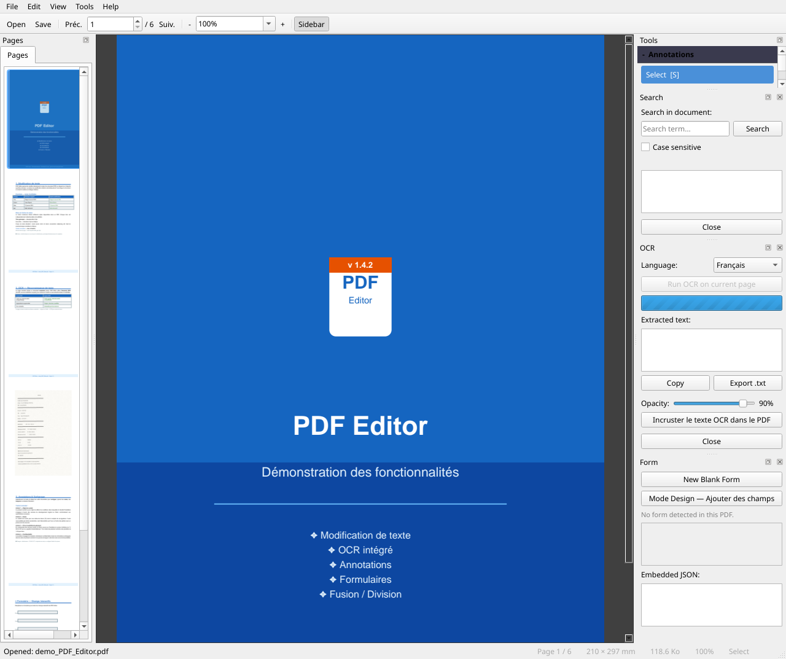
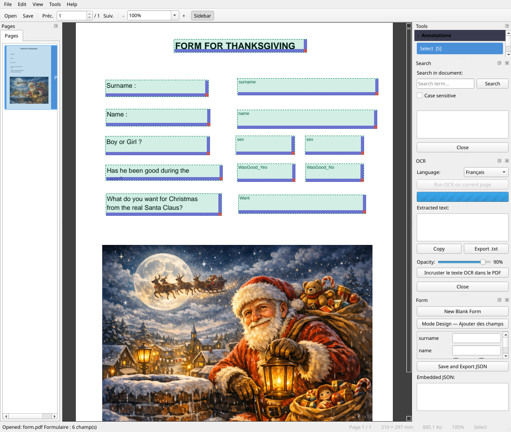
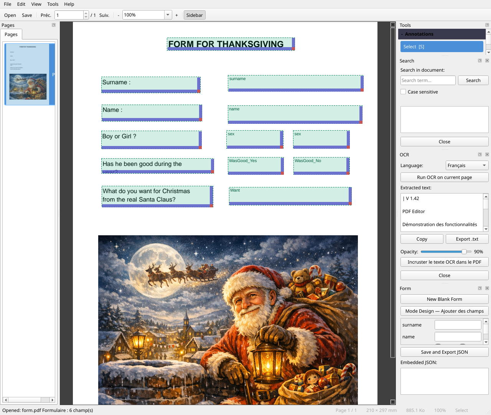
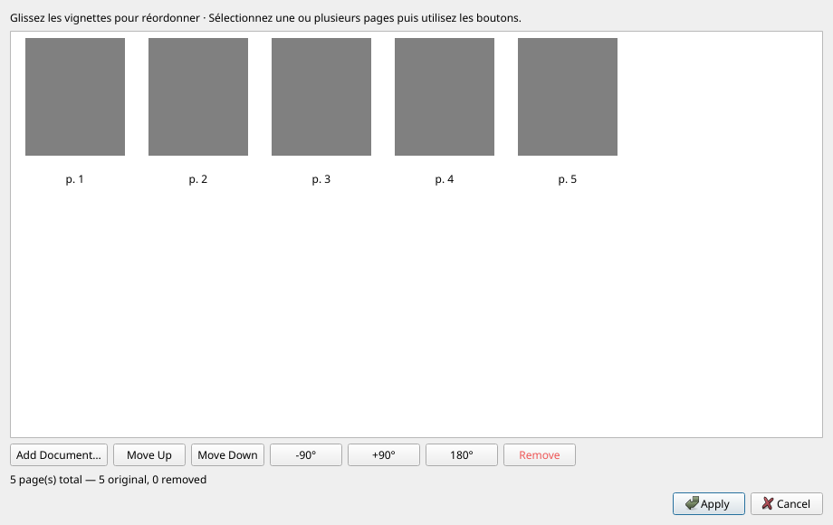
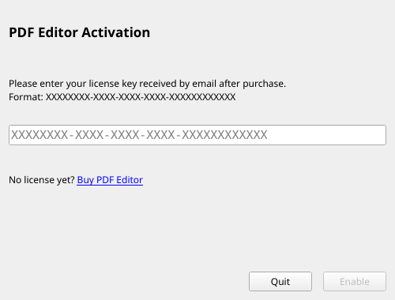
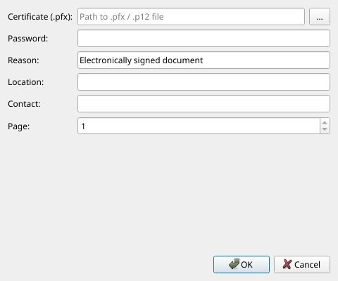

# User Manual — PDF Editor

**Version 1.5.8** · 01/07/2026

---

## Table of contents

1. [Overview](#presentation)
2. [Installation and first launch](#installation)
3. [General interface](#interface)
4. [Preferences](#preferences)
5. [Open and close a document](#ouvrir)
6. [Navigate the document](#navigation)
7. [Zoom and display](#zoom)
8. [Edit existing text](#modifier-texte)
9. [Insert text](#inserer-texte)
10. [Annotations](#annotations)
11. [Insert an image](#inserer-image)
12. [PDF forms](#formulaires)
13. [Optical Character Recognition (OCR)](#ocr)
14. [Page management — Reorganize / Merge / Split](#pages)
15. [Headers and footers](#entetes)
16. [Watermark](#filigrane)
17. [Text stamp](#tampon-texte)
18. [Image stamp — logo and signature](#tampon-image)
19. [Windows integration — right-click](#windows)
20. [Document metadata](#metadata)
21. [PDF compression](#compression)
22. [Password protection](#protection)
23. [Digital signature](#signature)
24. [Search](#recherche)
25. [Extract content](#extraction)
26. [Save the document](#enregistrer)
27. [Undo / Redo](#annuler)
28. [Themes and language](#langue)
29. [Keyboard shortcuts](#raccourcis)

---

> **New in v1.5.8**: **Tools** menu fully organized into sub-menus (*Insert / Organize / Extract / Secure / OCR*); **continuous scrolling** mode (`Ctrl+Maj+C`); **inline search bar**; centralized **Preferences** menu (`Edit > Preferences`); OCR layer with **full Unicode encoding** (Cyrillic, CJK, Arabic…); **inline OCR editor** (double-click any OCR line to correct it without a popup).
>
> **v1.5.0**: **Preferences** dialog, **Appearance**, **Full Screen**, page duplication, continuous viewing mode, inline search.
>
> **v1.4.1**: right-click **Combine in PDF Editor** (multi-file selection → pre-loaded reorganize dialog) · revised *Windows Integration* dialog with two separately enableable sections.
>
> **v1.4.0**: next/previous page navigation via scrollbar and wheel · text extraction with page range selection · summary popup after extraction · *Tools* panel aligned with the Tools menu · enhanced *About*.
>
> **v1.3.0**: extended side panel (*Language* and *Help* tabs) · *Signature* menu merged into *Tools* · icons in all menus · all PDF operations logged (`Ctrl+Z`).

---

<a name="presentation"></a>
## 1. Overview

**PDF Editor** is a free open-source PDF editor that lets you:

- Read and navigate any PDF file
- Edit existing text directly in the document
- Insert text, images and annotations
- Create and fill PDF forms
- Apply Optical Character Recognition (OCR) to scanned pages
- Reorganize, merge and split documents
- Assemble a new PDF from images (JPG, PNG, TIFF…)
- Add headers, footers, watermarks and stamps
- Edit metadata and compress the file
- Protect a document with a password
- Digitally sign with a `.pfx` certificate

---

<a name="installation"></a>
## 2. Installation and first launch

### Portable application

The application does not require installation. Double-click `PDFEditor.exe` to launch it.

### Installation via the installer

If you have the `PDFEditor-Setup.exe` file, run it and follow the wizard.
One step offers to install **Tesseract OCR** automatically (required for character recognition).

The installer can also **set PDF Editor as the default application** for opening PDF files (checked by default).

### First launch — Tesseract OCR

At first startup, if Tesseract is not detected on your computer, a window appears and offers to download and install it automatically (~50 MB).

- **OCR language**: select the main language of your documents (the system automatically detects the Windows language).
- **English** is always included as a fallback language.
- You can decline the installation; the OCR feature will simply be unavailable until Tesseract is installed manually.

---

<a name="interface"></a>
## 3. General interface


```
┌─────────────────────────────────────────────────────────────────┐
│  Menu  (File · Edit · View · Tools · Help)                      │
├─────────────────────────────────────────────────────────────────┤
│  Main toolbar  (◀ Prev. | Page no. / total | Next ▶ | Zoom)     │
├─────────────────────────────────────────────────────────────────┤
│  Pages toolbar  (Reorganize/Merge · Split · Delete …)           │
├─────────────────────────────────────────────────────────────────┤
│  Annotation toolbar  (Select · Edit Text · Highlight · …)       │
├──────────────────────┬──────────────────────────────────────────┤
│                      │                                          │
│  Side panel          │         PDF viewer                       │
│  [Pages]             │         (current page)                   │
│  [Tools]             │                                          │
│                      │          — or —                          │
│                      │                                          │
│                      │         Continuous viewer                │
│                      │         (vertical scrolling)             │
│                      │                                          │
├──────────────────────┴──────────────────────────────────────────┤
│  Status bar                                                     │
└─────────────────────────────────────────────────────────────────┘
```

- **Left side panel**: two tabs — *Pages* and *Tools*. Can be hidden with `F4`.
- **Viewer**: single page by default, or *continuous scrolling* mode (`View → Continuous scrolling`, `Ctrl+Maj+C`).
- **Search bar**: appears at the top of the reading area (`Ctrl+F`) and closes with `Échap`.
- **Status bar**: contextual messages, page number, unsaved modification indicator (`*`).

### Side panel tabs

| Tab | Content |
|-----|---------|
| **Pages** | Navigation thumbnails — click to go to a page |
| **Tools** | *Tools* section (same order as the menu) · *Annotations* section · *Shortcuts* section |

### Top menu bar

| Menu | Main content |
|------|--------------|
| **File** | Open, Save, Print, Quit |
| **Edit** | Undo, Redo, Search, **Preferences** |
| **View** | Zoom, Panel, Continuous scrolling, Full screen, Theme, Appearance |
| **Tools** | Actions grouped in sub-menus: *Insert*, *Organize*, *Extract*, *Secure*, *OCR* |
| **Help** | Manual, Shortcuts, Report a bug, Check for updates, About |

> Language, license, Windows integration and appearance are now centralized in **Edit > Preferences**.

---

<a name="preferences"></a>
## 4. Preferences

All application settings are grouped in a single dialog accessible via **Edit → Preferences** (`Ctrl+,`) :

| Tab | Content |
|-----|---------|
| **Language** | Choose the interface language (restart offered) |
| **Help and shortcuts** | Access to the manual and shortcut summary |
| **License and integration** | License management, Windows integration (right-click) |
| **Appearance** | Theme and color customization |

> Language, help and Windows integration are no longer in separate side-panel tabs — they live here.

---

<a name="ouvrir"></a>
## 5. Open and close a document

| Action | Method |
|--------|--------|
| Open a PDF | *File → 📂 Open…* or `Ctrl+O` |
| Open from Explorer | Drag and drop the file onto the window |
| Open from command line | `PDFEditor.exe my_document.pdf` |
| Close the document | *File → ✖ Close* or `Ctrl+W` |

If the document has unsaved modifications, a confirmation is requested before closing.

### Password-protected documents

When opening an encrypted file, a dialog asks for the user password. To access advanced editing options, the **owner password** may be required.

---

<a name="navigation"></a>
## 6. Navigate the document

| Action | Method |
|--------|--------|
| Next page | Click **Next ▶** or `→` |
| Previous page | Click **◀ Prev.** or `←` |
| Go to a specific page | Enter the number in the field and press `Entrée` |
| Scroll within the page | Mouse wheel or right scrollbar |
| Next page (wheel) | Scroll down at the **bottom of the page** |
| Previous page (wheel) | Scroll up at the **top of the page** |
| Next page (scrollbar) | Drag the scrollbar all the way down |
| Click a thumbnail | Left side panel — *Pages* tab |
| **Continuous scrolling** | `View → Continuous scrolling` or `Ctrl+Maj+C` |
| Double-click in continuous mode | Return to single-page display at the clicked page |

---

<a name="zoom"></a>
## 7. Zoom and display

| Action | Method |
|--------|--------|
| Zoom in | `Ctrl+=` or **+** button |
| Zoom out | `Ctrl+-` or **−** button |
| Fit page | `Ctrl+0` |
| Fit width | `Ctrl+1` |
| Custom zoom | Enter a percentage in the drop-down list |
| Zoom with the mouse | `Ctrl + wheel` |

---

<a name="modifier-texte"></a>
## 8. Edit existing text




PDF Editor lets you edit text directly in the document stream.

### Steps

1. In the annotation toolbar, select the **Edit Text** (`T`) tool.
2. **Double-click** the word or text block to edit.
3. A popup window appears with the text and formatting options:
   - Font, size, **Bold**, *Italic*, color, letter spacing
   - Background color (transparent by default)
4. Edit the text, adjust the formatting, then click **Confirm** (`Ctrl+Entrée`).

> **Tip**: the tool first attempts an **in-place** edit in the PDF stream. If that is not possible (unknown font, image text), it falls back to a replacement annotation.
>
> If the edit really cannot be applied (non-editable font, image text, empty block, stream injection failure), a **persistent message** appears in the **status bar** at the bottom of the window (e.g.: *"Cannot edit: in-place edit failed…"*).

### Undo

`Ctrl+Z` to undo · `Ctrl+Y` to redo (see [§27 Undo / Redo](#annuler)).

---

<a name="inserer-texte"></a>
## 9. Insert text

To add a new text block on an empty area:

1. Select the **Edit Text** (`T`) tool.
2. **Double-click** an empty area of the page.
3. The popup window opens with an empty editor.
4. Type your text, choose the formatting, then confirm.

The text is inserted as a permanent **FreeText** annotation in the PDF.

---

<a name="annotations"></a>
## 10. Annotations

The annotation toolbar provides several tools:

| Tool | Shortcut | Use |
|------|----------|-----|
| Select | `S` | Select and move existing annotations |
| Edit Text | `T` | Edit document text (see §8 and §9) |
| Highlight | `H` | Highlight a word or selection in yellow |
| Comment | `C` | Add a note (bubble) on the page |
| Image | `I` | Insert an image (see §11) |
| Erase | `E` | Delete an annotation by clicking it |

The same tools are available from the **Tools** tab of the left side panel, *Annotations* section (collapsed by default — click to expand).

### Line thickness

In the *Tools → Annotations* panel, the **Thickness** field sets the stroke thickness for drawing annotations (0.5 to 10 pt).

### Resize / move an annotation

In **Select** (`S`) mode:
- **Click** an annotation to select it (handles visible).
- **Drag** to move · **Drag a handle** to resize.
- `Suppr` key to delete the selected annotation.

---

<a name="inserer-image"></a>
## 11. Insert an image

**Method 1 — Menu**
1. *Tools → Insert → 🖼 Insert Image…*
2. Choose the image file (PNG, JPEG, BMP, WebP…).
3. Draw the destination area on the page.

**Method 2 — Toolbar**
1. Click **🖼 Insert Image** in the *Pages & Form* toolbar.
2. Same procedure.

**Method 3 — Tools panel**
1. Side panel **Tools** tab → *🖼 Insert Image…*

The image is embedded permanently in the PDF.

---

<a name="formulaires"></a>
## 12. PDF forms




### Enable Design Mode

Click **✏ Design Mode** in the *Pages & Form* toolbar.
In Design Mode, click-drag on the page creates a new field.

### Available field types

| Type | Description |
|------|-------------|
| Text | Free input field |
| Checkbox | Yes / No |
| Dropdown | Choice among predefined options |
| Radio buttons | Exclusive selection in a group |
| Label | Static non-editable text |

### Fill a form

In normal mode (Design disabled), click a field to fill it.
The side panel lists all fields with their values.

### Move a field

*Tools → ↔ Move Text Block* (`M`) then drag the field.

---

<a name="ocr"></a>
## 13. Optical Character Recognition (OCR)




**Prerequisite**: Tesseract OCR installed (see [§2](#installation)). In the installed Windows version, Tesseract is bundled.

### Run OCR

1. *Tools → OCR → 🔤 Character Recognition (OCR)…*
2. The OCR panel opens on the right.
3. Select the document **language**.
4. Click **Run OCR**.

### Supported languages

| Language | Code |
|----------|------|
| Français | `fra` |
| English | `eng` |
| Deutsch | `deu` |
| Español | `spa` |
| Italiano | `ita` |
| Português | `por` |
| Русский (Russian) | `rus` |

> The invisible text layer uses **full Unicode encoding** (UTF-16): Cyrillic, CJK, Arabic and all other scripts are correctly indexed (`Ctrl+F`) and can be copied — with no transliteration or character loss.

### Result

- The recognized text is displayed overlaid with colored blocks.
- Adjust the size/position of each block by drag-and-drop.
- Click **Embed in PDF** to make the text permanent.

> Embedded OCR blocks are invisible on screen but indexed by PDF readers (`Ctrl+F`, copy-paste…).

### Additional OCR options

| Option | Description |
|--------|-------------|
| *Tools → OCR → Reconstruct page with native text* | Replaces the page’s text elements with native PDF text (better editing quality). |
| *Tools → OCR → Apply correction as image patch* | Corrects OCR text by directly modifying the page image (experimental). |

### Correct an OCR line with a double-click

On a scanned PDF that already contains an OCR layer (for example after clicking **Embed in PDF**), you can correct a line directly from the viewer:

1. Make sure the active tool is **Edit Text** (`T`) or **Select** (`S`).
2. **Double-click** the scanned text line to correct.
3. An **inline** editing field (no popup window) appears in place of the line.
4. Correct the text.
5. Press **Entrée** to confirm, or **Échap** to cancel.

> The correction is saved as an invisible OCR annotation, indexed by search (`Ctrl+F`) and copy-paste. This operation is **undoable** via `Ctrl+Z`.

> **Tip**: the double-click is the fastest way to fix a typo in a scan. If the line is not recognized on click, first run *Tools → OCR → Character Recognition (OCR)…* then click **Embed in PDF**.

---

<a name="pages"></a>
## 14. Page management — Reorganize / Merge / Split




### Reorganize and merge pages

*Tools → Organize → ⊕ Reorganize/Merge Pages…* (or the **⊕ Reorganize/Merge** button in the toolbar)

This versatile tool works **with or without an open document**:

| Situation | Result |
|-----------|--------|
| PDF open | Reorganizes the pages of the current document |
| No PDF open | Creates a new PDF from scratch |

#### Organizer interface

- Pages are displayed as **thumbnails** that can be reordered by drag-and-drop.
- Select one or more thumbnails, then use the buttons:

| Button | Action |
|--------|--------|
| ▲ Up / ▼ Down | Move the selection |
| ↺ -90° / ↻ +90° / ↕ 180° | Rotate the selected pages |
| 🗑 Delete | Remove the selected pages |
| ➕ Add Document… | Insert pages from another document |

#### Add a document

The **➕ Add Document…** button accepts:
- **PDF** — all pages are added
- **Images**: JPG, JPEG, PNG, BMP, TIFF (including multi-page), WebP — each image becomes a page

> **Tip**: to **merge** several PDFs, open the organizer without a document open, add your files via "Add Document", order them, then click **Apply** — a "Save As" dialog will ask for the new PDF name.

> This operation is **undoable** via `Ctrl+Z`.

### Duplicate the current page

*Tools → Organize → Duplicate Current Page* or `Ctrl+Maj+P`.

> This operation is **undoable** via `Ctrl+Z`.

### Delete the current page

*Tools → Organize → 🗑 Delete Current Page* or `Ctrl+Suppr`.

> This operation is **undoable** via `Ctrl+Z`.

### Quick rotation of the current page

| Action | Method |
|--------|--------|
| Rotate +90° | *Tools → Organize → ↻ Rotate Page (+90°)* or `R` |
| Rotate -90° | *Tools → Organize → ↺ Rotate Page (-90°)* or `Maj+R` |

### Split this PDF

1. *Tools → Organize → ✂ Split this PDF…*
2. Enter the number of **pages per file** (e.g. `1` = one file per page, `5` = groups of 5 pages).
3. A preview shows how many files will be created.
4. Choose the destination folder and confirm.

---

<a name="entetes"></a>
## 15. Headers and footers

*Tools → ☰ Headers & Footers…*

Add automatic text at the top and/or bottom of each page.

### Text zones

Each zone (Header and Footer) has three columns: **Left · Center · Right**.

### Dynamic tokens

Insert variables that will be replaced automatically when applied:

| Token | Inserted value |
|-------|----------------|
| `{page}` | Current page number |
| `{total}` | Total number of pages |
| `{date}` | Today’s date (dd/mm/yyyy) |

Shortcut buttons under each field let you insert these tokens in one click.

### Common options

| Option | Description |
|--------|-------------|
| Font size | From 6 to 36 pt |
| Color | Black, Gray, Red, Blue |
| Margin from edge | Distance in mm from the page edge |
| Do not apply on 1st page | Useful for cover pages |

### Modify or remove

Reopen *Tools → ☰ Headers & Footers…*: the last used settings are reloaded.
- **Modify**: change the texts and click **Apply** again — the old headers are replaced.
- **Remove**: clear all fields and click **Apply** — the headers/footers are erased.

> This operation is **undoable** via `Ctrl+Z`.

---

<a name="filigrane"></a>
## 16. Watermark

*Tools → ◈ Watermark…*

Applies diagonal text on all pages of the document.

| Option | Description |
|--------|-------------|
| Text | Watermark label (e.g. `CONFIDENTIAL`) |
| Size | From 10 to 150 pt |
| Color | Gray, Red, Blue, Green, Black |
| Opacity | From 5 % (very transparent) to 100 % (opaque) |

> The watermark is embedded in the PDF content — it appears when printing.

> This operation is **undoable** via `Ctrl+Z`.

---

<a name="tampon-texte"></a>
## 17. Text stamp

*Tools → Insert → 🖊 Text Stamp…*

Applies a stamp-style "seal" (framed text) on one or more pages.

### Available stamps

| Stamp | Color |
|-------|-------|
| APPROVED | Green |
| REJECTED | Red |
| TO SIGN | Blue |
| CONFIDENTIAL | Red |
| DRAFT | Gray |
| URGENT | Orange |
| COPY | Gray |
| TO REVIEW | Orange |
| Custom… | Any color (free text) |

### Options

| Option | Description |
|--------|-------------|
| Position | Top-right, Top-left, Bottom-right, Bottom-left, Center |
| Pages | All pages, First page, Last page |
| Rotation | Horizontal (0°) or Diagonal (−45°) |
| Opacity | From 10 % to 100 % |

A **real-time preview** is displayed on the right of the dialog.

> This operation is **undoable** via `Ctrl+Z`.

---

<a name="tampon-image"></a>
## 18. Image stamp — logo and signature

*Tools → Insert → 🖼 Image Stamp…*

Applies an image (company logo, scanned signature, seal…) on one or more pages. Added stamps are **saved from session to session** in a personal library.

### Stamp library

The library is stored in `~/.pdf_editor/stamps/`. It is empty at first launch.

| Button | Action |
|--------|--------|
| ➕ Add… | Import an image (PNG, JPG, BMP, WebP, TIFF) and give it a name |
| 🗑 Delete | Remove the selected stamp from the library |

### Options

| Option | Description |
|--------|-------------|
| Position | Bottom-right, Bottom-left, Top-right, Top-left, Center |
| Pages | All pages, First page, Last page |
| Size | Percentage of page width (5 % to 100 %) |
| Opacity | From 10 % to 100 % |

> **Transparency**: PNG images with transparent background (signatures, logos) keep their transparency in the PDF.

A **real-time preview** is displayed on the right of the dialog.

> This operation is **undoable** via `Ctrl+Z`.

---

<a name="windows"></a>
## 19. Windows integration — right-click




*Edit → Preferences → License and Integration → Windows Integration (right-click)…*

PDF Editor offers two entries in the Windows Explorer context menu, both **enabled automatically** at first launch. They are managed via *Edit → Preferences → License and Integration*.

### Context menu entries

| Entry | Action |
|--------|--------|
| **Open with PDF Editor** | Opens the selected file in the application. |
| **Combine in PDF Editor** | Multi-file selection → opens the reorganize dialog pre-loaded with the selected PDFs ready to merge. |

### Convert an image to PDF

Converts an image file to PDF with a single right-click (background processing, no interface).

**Usage**

1. Right-click an image file in Explorer.
2. Select **Convert to PDF - PDF EDITOR**.
3. The PDF is created in the **same folder**, with the same base name (`.pdf`).
4. A confirmation appears at the end.

**Formats**: JPG · JPEG · PNG · BMP · TIFF · TIF · WebP

> If a PDF with the same name already exists, a numeric suffix is added (`file_1.pdf`, `file_2.pdf`…).

---

### Combine files in PDF Editor

Opens the **Reorganize/Merge** dialog with several files pre-loaded. Ideal for quickly assembling PDFs and/or images into a single document.

**Usage**

1. In Windows Explorer, **select multiple files** (Ctrl+click or Shift+click).
2. **Right-click** the selection.
3. Choose **Combine in PDF Editor**.
4. PDF Editor opens and displays the reorganize dialog with all files pre-loaded as thumbnails.
5. Reorder the pages as needed, then click **Apply** and save.

**Supported formats**: PDF · JPG · JPEG · PNG · BMP · TIFF · TIF · WebP

> The entry also appears when right-clicking a single compatible file.
> Images are automatically converted to a temporary PDF before being shown in the dialog.

---

<a name="metadata"></a>
## 20. Document metadata

*Tools → ℹ Metadata…*

View and edit the information stored in the PDF file:

| Field | Description |
|-------|-------------|
| Title | Document title |
| Author | Author name |
| Subject | Theme or short description |
| Keywords | Keywords separated by commas |
| Application | Software that created the document |

This metadata is visible in the file properties (Windows Explorer, PDF readers).

> This operation is **undoable** via `Ctrl+Z`.

---

<a name="compression"></a>
## 21. PDF compression

*Tools → ⚡ Compress PDF*

Reduces file size by optimizing the PDF internal streams (object compression and recompression of existing data).

- Compression is applied **immediately** to the open document.
- A message at the bottom of the screen indicates the reduction achieved (in KB or MB).
- Remember to save (`Ctrl+S`) to keep the result.

> The effect is more noticeable on non-optimized PDFs (Word exports, scans…). Already compressed PDFs will show little difference.

> This operation is **undoable** via `Ctrl+Z`.

---

<a name="protection"></a>
## 22. Password protection

### Protect a document

1. *Tools → Secure → 🔒 Password Protect…*
2. Enter a **user** password (reading) and/or **owner** password (editing).
3. Confirm — the document will be encrypted and saved to a new file.

### Remove protection

1. Open the document with the owner password.
2. *Tools → Secure → 🔓 Remove Protection…*
3. Protection is removed and saved to a new file.

---

<a name="signature"></a>
## 23. Digital signature




PDF Editor can sign a document with a `.pfx` / `.p12` digital certificate.

### Access

- Via the menu: *Tools → Secure → ✍ Sign Document…*
- Via the side panel: **Tools** tab → *✍ Sign Document…*

### Sign

1. *Tools → Secure → ✍ Sign Document…*
2. Fill in:
   - **Path to certificate**: `.pfx` or `.p12` file
   - Certificate **password**
   - **Reason** and **Location** (optional)
   - **Page** where to place the visible signature
3. Click **OK**.

### Verify signatures

*Tools → Secure → 🔎 Verify Signatures…* (or the *🔎 Verify Signatures…* button in the Tools panel) displays the list of signatures and their validity status.

### Get a `.pfx` certificate

*Help → 🔑 How to get a .pfx certificate?* explains the options:
- Certificate from a Certification Authority (Certum, Sectigo, GlobalSign…)
- Self-signed certificate with OpenSSL (internal use only)

---

<a name="recherche"></a>
## 24. Search

1. *Edit → 🔍 Search…* or `Ctrl+F`.
2. An **inline search bar** appears at the top of the viewer.
3. Enter the term to search for.
4. Occurrences are highlighted; use **Previous / Next** to navigate.
5. Press `Échap` or click ✕ to close the bar.

---

<a name="extraction"></a>
## 25. Extract content

### Extract text

*Tools → Extract → 📄 Extract Text…* (or button in the *Tools* panel)

A dialog lets you choose the pages to extract:

| Option | Description |
|--------|-------------|
| **All pages** | Extracts text from the entire document |
| **Current page (N)** | Extracts only the displayed page |
| **Range** | Enter a range *From page X to Y* |

After confirming the destination file, a **summary** is displayed:
- Extracted pages
- Number of characters, words and lines
- Size of the generated file

### Extract images

*Tools → Extract → 🖼 Extract Images…* → choose a destination folder.

All images embedded in the PDF are extracted into the chosen folder.

---

<a name="enregistrer"></a>
## 26. Save the document

| Action | Shortcut |
|--------|----------|
| Save | `Ctrl+S` |
| Save As… | `Ctrl+Maj+S` |

> The window title displays an asterisk `*` when the document has unsaved modifications.

---

<a name="annuler"></a>
## 27. Undo / Redo

PDF Editor has a full modification history allowing you to undo or redo all operations.

| Shortcut | Action |
|----------|--------|
| `Ctrl+Z` | Undo the last operation |
| `Ctrl+Y` | Redo |

The history is also accessible via *Edit → ↩ Undo* and *Edit → ↪ Redo*.

### Undoable operations

| Operation | Undoable |
|-----------|----------|
| Add an annotation | ✅ |
| Move a text block | ✅ |
| Page rotation | ✅ |
| Watermark | ✅ |
| Headers / footers | ✅ |
| Text stamp | ✅ |
| Image stamp | ✅ |
| PDF compression | ✅ |
| Metadata | ✅ |
| Reorganize / merge pages | ✅ |
| Delete a page | ✅ |
| Protect / unprotect | ❌ (creates a new file) |
| Sign | ❌ (irreversible operation) |
| Split | ❌ (creates new files) |

> History is cleared when opening a new document.

---

<a name="langue"></a>
## 28. Themes and language

### Theme

*View → Dark Theme* — enables/disables dark theme with a simple toggle (saved in preferences).

*View → Appearance…* opens the appearance dialog for finer settings.

### Interface language

**Primary method**: *Edit → Preferences → Language*, then choose the desired language.

A restart is offered to apply the change. Available languages are:

| Code | Language |
|------|----------|
| 🇫🇷 `fr` | Français |
| 🇬🇧 `en` | English |
| 🇩🇪 `de` | Deutsch |
| 🇪🇸 `es` | Español |
| 🇮🇹 `it` | Italiano |
| 🇵🇹 `pt` | Português |
| 🇷🇺 `ru` | Русский |

### Help and support

*Help* provides quick access to:
- **📖 User Manual** (equivalent to `F1`)
- **🐛 Report a bug…** — opens the bug report form
- **💡 Suggest an improvement…** — opens the suggestion form
- **🔄 Check for updates…**
- The main **keyboard shortcuts** list

Windows integration (right-click) is now configured from *Edit → Preferences → License and Integration* (see [§19](#windows)).

### About

*Help → ℹ About* displays the version, technologies used and the support link.

---

<a name="raccourcis"></a>
## 29. Keyboard shortcuts

### File

| Shortcut | Action |
|----------|--------|
| `Ctrl+O` | Open a file |
| `Ctrl+S` | Save |
| `Ctrl+Maj+S` | Save As |
| `Ctrl+P` | Print |
| `Ctrl+W` | Close the document |
| `Alt+F4` | Quit |

### Edit

| Shortcut | Action |
|----------|--------|
| `Ctrl+Z` | Undo |
| `Ctrl+Y` | Redo |
| `Ctrl+F` | Search (inline bar) |
| `Ctrl+,` | Preferences |

### Navigation

| Shortcut | Action |
|----------|--------|
| `←` | Previous page |
| `→` | Next page |
| `Ctrl+Maj+C` | Enable/disable continuous scrolling |

### View

| Shortcut | Action |
|----------|--------|
| `Ctrl+=` | Zoom in |
| `Ctrl+-` | Zoom out |
| `Ctrl+0` | Fit page |
| `Ctrl+1` | Fit width |
| `F4` | Show/hide side panel (Pages/Tools) |
| `F5` | Show/hide toolbar |
| `F11` | Full screen |

### Tools

| Shortcut | Action |
|----------|--------|
| `S` | Select tool |
| `T` | Edit Text tool |
| `H` | Highlight tool |
| `C` | Comment tool |
| `I` | Image tool |
| `E` | Erase tool |
| `M` | Move Text Block |
| `R` | Rotate page +90° |
| `Maj+R` | Rotate page -90° |
| `Ctrl+Suppr` | Delete current page |
| `Ctrl+Maj+P` | Duplicate current page |
| `F1` | User Manual |

---

*Manual updated on 01/07/2026 — PDF Editor v1.5.8*  
