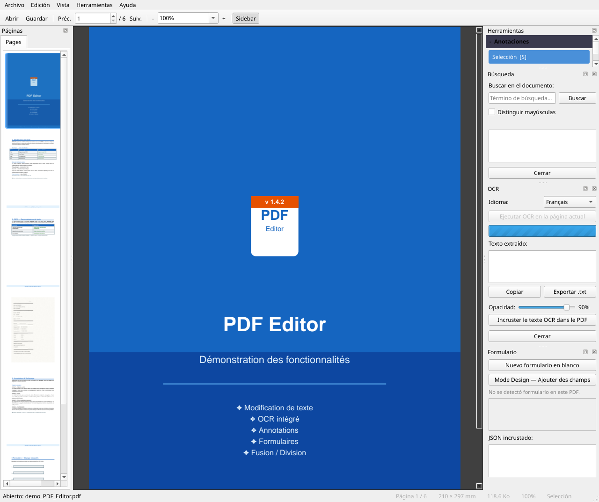
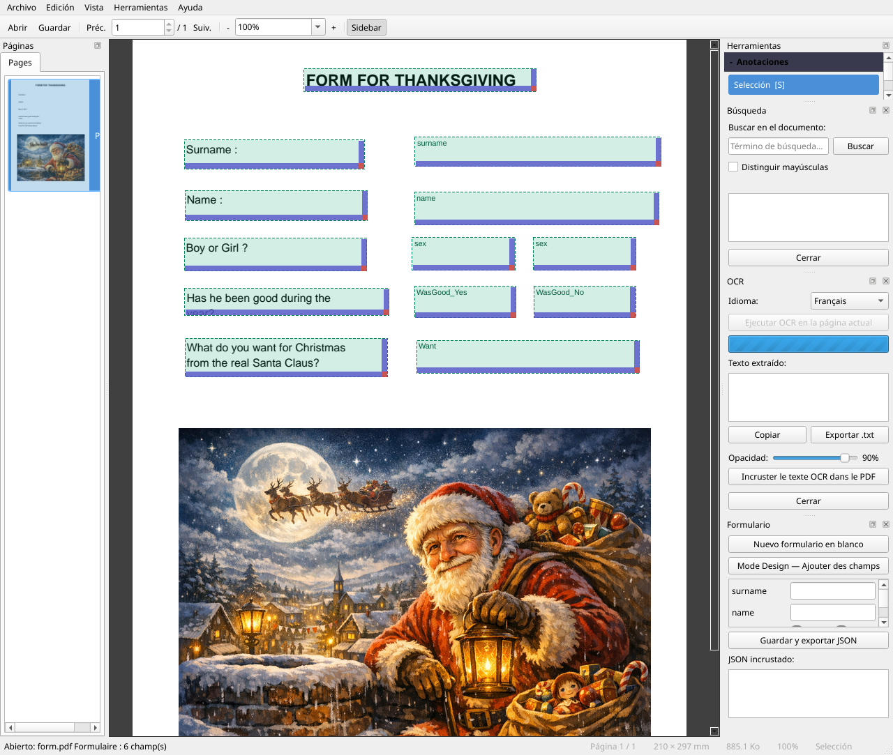
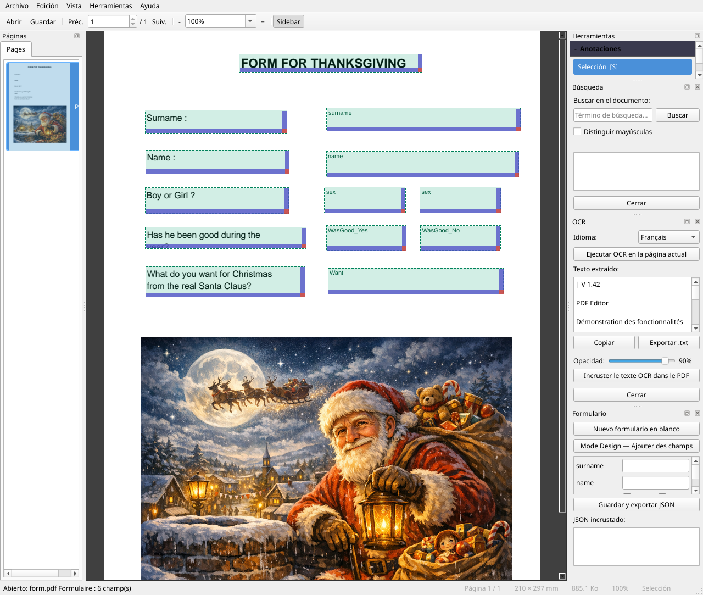
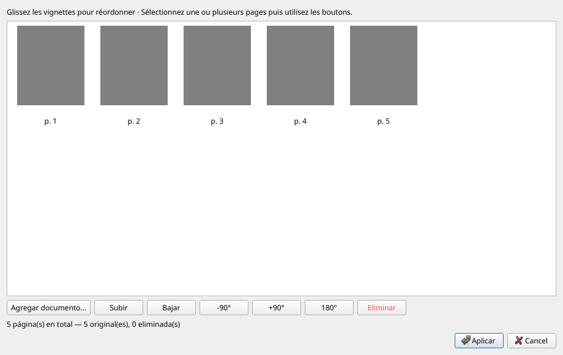
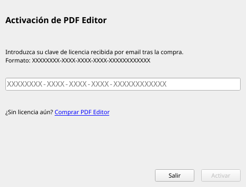
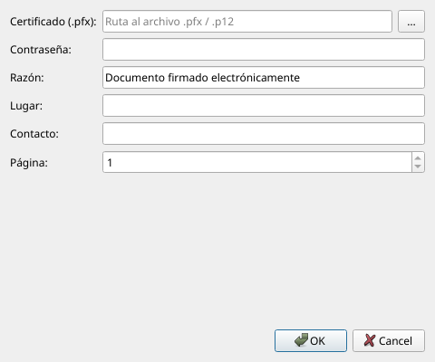

# Manual de usuario — PDF Editor

**Versión 1.5.8** · 01/07/2026

---

## Índice

1. [Presentación](#presentation)
2. [Instalación y primer inicio](#installation)
3. [Interfaz general](#interface)
4. [Preferencias](#preferences)
5. [Abrir y cerrar un documento](#ouvrir)
6. [Navegación en el documento](#navigation)
7. [Zoom y visualización](#zoom)
8. [Modificar el texto existente](#modifier-texte)
9. [Insertar texto](#inserer-texte)
10. [Anotaciones](#annotations)
11. [Insertar imagen](#inserer-image)
12. [Formularios PDF](#formulaires)
13. [Reconocimiento de caracteres (OCR)](#ocr)
14. [Gestión de páginas — Reorganizar / Combinar / Dividir](#pages)
15. [Encabezados y pies de página](#entetes)
16. [Marca de agua](#filigrane)
17. [Sello de texto](#tampon-texte)
18. [Sello de imagen — logo y firma](#tampon-image)
19. [Integración Windows — clic derecho](#windows)
20. [Metadatos del documento](#metadata)
21. [Compresión PDF](#compression)
22. [Protección por contraseña](#protection)
23. [Firma digital](#signature)
24. [Búsqueda de texto](#recherche)
25. [Extracción de contenido](#extraction)
26. [Guardar el documento](#enregistrer)
27. [Deshacer / Rehacer](#annuler)
28. [Temas e idioma](#langue)
29. [Atajos de teclado](#raccourcis)

---

> **Novedades v1.5.8** : menú **Herramientas** completamente organizado en submenús (*Insertar / Organizar / Extraer / Proteger / OCR*) ; modo **desplazamiento continuo** (`Ctrl+Mayús+C`) ; **barra de búsqueda inline** ; menú **Preferencias** centralizado (`Edición > Preferencias`) que agrupa idioma, ayuda, licencia e integración Windows.
>
> **v1.5.0** : diálogo **Preferencias**, **Apariencia**, **Pantalla completa**, duplicación de página, modo de visualización continuo, búsqueda inline.
>
> **v1.4.1** : menú contextual **Combinar en PDF Editor** (selección múltiple de archivos → diálogo de reorganización precargado) ; diálogo *Integración Windows* revisado con dos secciones activables por separado.
>
> **v1.4.0** : navegación página siguiente/anterior mediante la barra de desplazamiento y la rueda del ratón ; extracción de texto con elección de intervalo de páginas ; ventana emergente de resumen tras la extracción ; panel *Herramientas* alineado con el menú Herramientas ; *Acerca de* enriquecido.
>
> **v1.3.0** : panel lateral extendido (pestañas *Idioma* y *Ayuda*) ; menú *Firma* fusionado en *Herramientas* ; iconos en todos los menús ; todas las operaciones PDF registradas (`Ctrl+Z`).

---

<a name="presentation"></a>
## 1. Presentación

**PDF Editor** es un editor de PDF gratuito y de código abierto que permite:

- Leer y navegar por cualquier archivo PDF
- Modificar el texto existente directamente en el documento
- Insertar texto, imágenes y anotaciones
- Crear y rellenar formularios PDF
- Aplicar reconocimiento de caracteres (OCR) en páginas escaneadas
- Reorganizar, combinar y dividir documentos
- Crear un nuevo PDF a partir de imágenes (JPG, PNG, TIFF…)
- Añadir encabezados, pies de página, marcas de agua y sellos
- Editar metadatos y comprimir el archivo
- Proteger un documento con contraseña
- Firmar digitalmente con un certificado `.pfx`

---

<a name="installation"></a>
## 2. Instalación y primer inicio

### Aplicación portable

La aplicación no requiere instalación. Haga doble clic en `PDFEditor.exe` para iniciarla directamente.

### Instalación mediante el instalador

Si dispone del archivo `PDFEditor-Setup.exe`, ejecútelo y siga el asistente.
Un paso ofrece la instalación automática de **Tesseract OCR** (necesario para el reconocimiento de caracteres).

El instalador también ofrece **definir PDF Editor como aplicación predeterminada** para abrir archivos PDF (opción marcada por defecto).

### Primer inicio — Tesseract OCR

En el primer inicio, si Tesseract no se detecta en su equipo, aparece una ventana que ofrece descargarlo e instalarlo automáticamente (~50 MB).

- **Idioma OCR** : seleccione el idioma principal de sus documentos (el sistema detecta automáticamente el idioma de Windows).
- El **inglés** siempre se incluye como idioma de respaldo.
- Puede rechazar la instalación; la función OCR simplemente no estará disponible hasta que Tesseract se instale manualmente.

---

<a name="interface"></a>
## 3. Interfaz general




```
┌─────────────────────────────────────────────────────────────────┐
│  Menú  (Archivo · Edición · Vista · Herramientas · Ayuda)       │
├─────────────────────────────────────────────────────────────────┤
│  Barra principal  (◀ Ant. | Nº página / total | Sig. ▶ | Zoom)  │
├─────────────────────────────────────────────────────────────────┤
│  Barra de páginas  (Reorganizar/Combinar · Dividir · Elim. …)   │
├─────────────────────────────────────────────────────────────────┤
│  Barra de anotaciones  (Selección · Texto · Resaltar · …)       │
├──────────────────────┬──────────────────────────────────────────┤
│                      │                                          │
│  Panel lateral       │         Visor PDF                        │
│  [Páginas]           │         (página actual)                  │
│  [Herramientas]      │                                          │
│                      │          — o —                           │
│                      │                                          │
│                      │         Desplazamiento continuo          │
│                      │         (desplazamiento vertical)        │
│                      │                                          │
├──────────────────────┴──────────────────────────────────────────┤
│  Barra de estado                                                 │
└─────────────────────────────────────────────────────────────────┘
```

- **Panel lateral izquierdo** : dos pestañas — *Páginas* y *Herramientas*. Se puede ocultar con `F4`.
- **Visor** : página única por defecto, o modo *desplazamiento continuo* (`Vista → Desplazamiento continuo`, `Ctrl+Mayús+C`).
- **Barra de búsqueda** : aparece en la parte superior de la zona de lectura (`Ctrl+F`) y se cierra con `Esc`.
- **Barra de estado** : mensajes contextuales, número de página, indicador de modificaciones no guardadas (`*`).

### Pestañas del panel lateral

| Pestaña | Contenido |
|--------|---------|
| **Páginas** | Miniaturas de navegación — haga clic para ir a una página |
| **Herramientas** | Sección *Herramientas* (mismo orden que el menú) · sección *Anotaciones* · sección *Atajos* |

### Menús de la barra superior

| Menú | Contenido principal |
|------|------------------|
| **Archivo** | Abrir, Guardar, Imprimir, Salir |
| **Edición** | Deshacer, Rehacer, Buscar, **Preferencias** |
| **Vista** | Zoom, Panel, Desplazamiento continuo, Pantalla completa, Tema, Apariencia |
| **Herramientas** | Acciones agrupadas en submenús: *Insertar*, *Organizar*, *Extraer*, *Proteger*, *OCR* |
| **Ayuda** | Manual, Atajos, Reportar un error, Buscar actualizaciones, Acerca de |

> El idioma, la licencia, la integración Windows y la apariencia están ahora centralizados en **Edición > Preferencias**.

---

<a name="preferences"></a>
## 4. Preferencias

Todos los ajustes de la aplicación se agrupan en un único diálogo accesible desde **Edición → Preferencias** (`Ctrl+,`) :

| Pestaña | Contenido |
|--------|---------|
| **Idioma** | Elección del idioma de la interfaz (se propone reiniciar) |
| **Ayuda y atajos** | Acceso al manual y resumen de atajos |
| **Licencia e integración** | Gestión de la licencia, integración Windows (clic derecho) |
| **Apariencia** | Personalización del tema y los colores |

> El idioma, la ayuda y la integración Windows ya no están en pestañas separadas del panel lateral — se encuentran aquí.

---

<a name="ouvrir"></a>
## 5. Abrir y cerrar un documento

| Acción | Método |
|--------|---------|
| Abrir un PDF | *Archivo → 📂 Abrir…* o `Ctrl+O` |
| Abrir desde el explorador | Arrastrar y soltar el archivo en la ventana |
| Abrir en línea de comandos | `PDFEditor.exe mi_documento.pdf` |
| Cerrar el documento | *Archivo → ✖ Cerrar* o `Ctrl+W` |

Si el documento tiene modificaciones no guardadas, se solicita confirmación antes de cerrar.

### Documentos protegidos por contraseña

Al abrir un archivo cifrado, un cuadro de diálogo solicita la contraseña de usuario. Para acceder a las opciones de modificación avanzadas, puede requerirse la **contraseña de propietario**.

---

<a name="navigation"></a>
## 6. Navegación en el documento

| Acción | Método |
|--------|---------|
| Página siguiente | Clic en **Sig. ▶** o tecla `→` |
| Página anterior | Clic en **◀ Ant.** o tecla `←` |
| Ir a una página exacta | Escribir el número en el campo y pulsar `Intro` |
| Desplazarse por la página | Rueda del ratón o barra de desplazamiento derecha |
| Página siguiente (rueda) | Rueda hacia abajo al **final de página** |
| Página anterior (rueda) | Rueda hacia arriba al **inicio de página** |
| Página siguiente (barra) | Arrastrar la barra hasta abajo |
| Clic en una miniatura | Panel lateral izquierdo — pestaña *Páginas* |
| **Desplazamiento continuo** | `Vista → Desplazamiento continuo` o `Ctrl+Mayús+C` |
| Doble clic en modo continuo | Volver a la vista de página única en la página clicada |

---

<a name="zoom"></a>
## 7. Zoom y visualización

| Acción | Método |
|--------|---------|
| Ampliar | `Ctrl+=` o botón **+** |
| Reducir | `Ctrl+-` o botón **−** |
| Ajustar a la página | `Ctrl+0` |
| Ajustar al ancho | `Ctrl+1` |
| Zoom personalizado | Escribir un porcentaje en la lista desplegable |
| Zoom con el ratón | `Ctrl + rueda` |

---

<a name="modifier-texte"></a>
## 8. Modificar el texto existente


PDF Editor permite modificar el texto directamente en el flujo del documento.

### Pasos

1. En la barra de anotaciones, seleccione la herramienta **Editar texto** (`T`).
2. **Haga doble clic** en la palabra o bloque de texto a modificar.
3. Aparece una ventana emergente con el texto y las opciones de formato:
   - Fuente, tamaño, **Negrita**, *Cursiva*, color, espaciado entre letras
   - Color de fondo (transparente por defecto)
4. Modifique el texto, ajuste el formato y haga clic en **Confirmar** (`Ctrl+Intro`).

> **Consejo** : la herramienta intenta primero una modificación **en el lugar** en el flujo PDF. Si no es posible (fuente desconocida, texto en imagen), pasa a una anotación de reemplazo.
>
> Si la modificación realmente no se puede aplicar (fuente no editable, texto en imagen, bloque vacío, fallo al inyectar en el flujo), aparece un **mensaje persistente** en la **barra de estado** inferior de la ventana (ej.: *"Modificación imposible: edición en el lugar fallida…"*).

### Deshacer

`Ctrl+Z` para deshacer · `Ctrl+Y` para rehacer (ver [§27 Deshacer / Rehacer](#annuler)).

---

<a name="inserer-texte"></a>
## 9. Insertar texto

Para añadir un nuevo bloque de texto en una zona vacía:

1. Seleccione la herramienta **Editar texto** (`T`).
2. **Haga doble clic** en una zona vacía de la página.
3. Se abre la ventana emergente con un editor vacío.
4. Escriba su texto, elija el formato y confirme.

El texto se inserta como **anotación FreeText** permanente en el PDF.

---

<a name="annotations"></a>
## 10. Anotaciones

La barra de anotaciones ofrece varias herramientas:

| Herramienta | Atajo | Uso |
|-------|-----------|-------|
| Selección | `S` | Seleccionar y mover anotaciones existentes |
| Editar texto | `T` | Editar el texto del documento (ver §8 y §9) |
| Resaltar | `H` | Resaltar una palabra o selección en amarillo |
| Comentario | `C` | Añadir una nota (burbuja) en la página |
| Imagen | `I` | Insertar una imagen (ver §11) |
| Borrar | `E` | Eliminar una anotación haciendo clic sobre ella |

Las mismas herramientas están disponibles desde la pestaña **Herramientas** del panel lateral izquierdo, sección *Anotaciones* (reducida por defecto — haga clic para desplegar).

### Grosor del trazo

En el panel *Herramientas → Anotaciones*, el campo **Grosor** ajusta el grosor del trazo de las anotaciones de dibujo (0,5 a 10 pt).

### Cambiar tamaño / mover una anotación

En modo **Selección** (`S`):
- **Haga clic** en una anotación para seleccionarla (manijas visibles).
- **Arrastre** para mover · **Arrastre una manija** para redimensionar.
- Tecla `Supr` para eliminar la anotación seleccionada.

---

<a name="inserer-image"></a>
## 11. Insertar imagen

**Método 1 — Menú**
1. *Herramientas → Insertar → 🖼 Insertar imagen…*
2. Elija el archivo de imagen (PNG, JPEG, BMP, WebP…).
3. Dibuje la zona de destino en la página.

**Método 2 — Barra de herramientas**
1. Haga clic en **🖼 Insertar imagen** en la barra *Páginas & Formulario*.
2. Mismo procedimiento.

**Método 3 — Panel Herramientas**
1. Pestaña **Herramientas** del panel lateral → *🖼 Insertar imagen…*

La imagen se integra de forma permanente en el PDF.

---

<a name="formulaires"></a>
## 12. Formularios PDF




### Activar el modo Diseño

Haga clic en **✏ Modo Diseño** en la barra *Páginas & Formulario*.
En modo Diseño, arrastrar al hacer clic en la página crea un campo nuevo.

### Tipos de campos disponibles

| Tipo | Descripción |
|------|-------------|
| Texto | Campo de entrada libre |
| Casilla de verificación | Sí / No |
| Lista desplegable | Elección entre opciones predefinidas |
| Botones de opción | Selección excluyente en un grupo |
| Etiqueta | Texto estático no editable |

### Rellenar un formulario

En modo normal (Diseño desactivado), haga clic en un campo para rellenarlo.
El panel lateral lista todos los campos con sus valores.

### Mover un campo

*Herramientas → Mover bloque de texto* (`M`) y luego arrastre el campo.

---

<a name="ocr"></a>
## 13. Reconocimiento de caracteres (OCR)




**Requisito previo** : Tesseract OCR instalado (ver [§2](#installation)). En la versión instalada de Windows, Tesseract está incluido.

### Iniciar el OCR

1. *Herramientas → OCR → 🔤 Reconocimiento de caracteres (OCR)…*
2. El panel OCR se abre a la derecha.
3. Seleccione el **idioma** del documento.
4. Haga clic en **Ejecutar OCR**.

### Resultado

- El texto reconocido se muestra en superposición con bloques coloreados.
- Ajuste el tamaño/posición de cada bloque arrastrándolo.
- Haga clic en **Incrustar en el PDF** para hacer el texto permanente.

> Los bloques OCR incrustados son invisibles en pantalla pero indexados por los lectores PDF (`Ctrl+F`, copiar-pegar…).

### Opciones OCR adicionales

| Opción | Descripción |
|--------|-------------|
| *Herramientas → OCR → Reconstruir página con texto nativo* | Reemplaza los elementos de texto de la página por texto PDF nativo (mejor calidad de edición). |
| *Herramientas → OCR → Aplicar corrección en parche de imagen* | Corrige un texto OCR modificando directamente la imagen de la página (experimental). |

### Corregir una línea OCR con doble clic

En un PDF escaneado que ya contiene una capa OCR (por ejemplo tras hacer clic en **Incrustar en el PDF**), puede corregir una línea directamente desde el visor:

1. Asegúrese de que la herramienta activa sea **Editar texto** (`T`) o **Selección** (`S`).
2. **Haga doble clic** en la línea de texto escaneado que desea corregir.
3. Aparece un campo de edición **inline** (sin ventana emergente) en lugar de la línea.
4. Corrija el texto.
5. Pulse `Intro` para confirmar, o `Esc` para cancelar.

> La corrección se guarda como anotación OCR invisible, indexada por la búsqueda (`Ctrl+F`) y el copiar-pegar. Esta operación es **deshacible** con `Ctrl+Z`.

> **Consejo** : el doble clic es la forma más rápida de corregir un error tipográfico en un escaneado. Si la línea no se reconoce al hacer clic, inicie primero *Herramientas → OCR → Reconocimiento de caracteres (OCR)…* y luego haga clic en **Incrustar en el PDF**.

---

<a name="pages"></a>
## 14. Gestión de páginas — Reorganizar / Combinar / Dividir




### Reorganizar y combinar páginas

*Herramientas → Organizar → ⊕ Reorganizar/Combinar páginas…* (o botón **⊕ Reorganizar/Combinar** en la barra)

Esta herramienta versátil funciona **con o sin documento abierto**:

| Situación | Resultado |
|-----------|----------|
| PDF abierto | Reorganiza las páginas del documento actual |
| Ningún PDF abierto | Crea un nuevo PDF desde cero |

#### Interfaz del organizador

- Las páginas se muestran como **miniaturas** reordenables mediante arrastrar y soltar.
- Seleccione una o varias miniaturas y utilice los botones:

| Botón | Acción |
|--------|--------|
| ▲ Subir / ▼ Bajar | Mover la selección |
| ↺ -90° / ↻ +90° / ↕ 180° | Rotar las páginas seleccionadas |
| 🗑 Eliminar | Retirar las páginas seleccionadas |
| ➕ Agregar documento… | Insertar páginas desde otro documento |

#### Agregar un documento

El botón **➕ Agregar documento…** acepta:
- **PDF** — se añaden todas las páginas
- **Imágenes** : JPG, JPEG, PNG, BMP, TIFF (incluidas multipágina), WebP — cada imagen se convierte en una página

> **Consejo** : para **combinar** varios PDFs, abra el organizador sin documento abierto, añada sus archivos mediante "Agregar documento", ordénelos y haga clic en **Aplicar** — un "Guardar como" le pedirá el nombre del nuevo PDF.

> Esta operación es **deshacible** con `Ctrl+Z`.

### Duplicar la página actual

*Herramientas → Organizar → Duplicar página actual* o `Ctrl+Mayús+P`.

> Esta operación es **deshacible** con `Ctrl+Z`.

### Eliminar la página actual

*Herramientas → Organizar → 🗑 Eliminar página actual* o `Ctrl+Supr`.

> Esta operación es **deshacible** con `Ctrl+Z`.

### Rotación rápida de la página actual

| Acción | Método |
|--------|---------|
| Girar +90° | *Herramientas → Organizar → ↻ Rotar página (+90°)* o `R` |
| Girar -90° | *Herramientas → Organizar → ↺ Rotar página (-90°)* o `Mayús+R` |

### Dividir este PDF

1. *Herramientas → Organizar → ✂ Dividir este PDF…*
2. Indique el número de **páginas por archivo** (ej. `1` = un archivo por página, `5` = grupos de 5 páginas).
3. Una vista previa indica el número de archivos que se crearán.
4. Elija la carpeta de destino y confirme.

---

<a name="entetes"></a>
## 15. Encabezados y pies de página

*Herramientas → ☰ Encabezados y pies de página…*

Añade texto automático en la parte superior y/o inferior de cada página.

### Zonas de texto

Cada zona (Encabezado y Pie de página) tiene tres columnas: **Izquierda · Centro · Derecha**.

### Tokens dinámicos

Inserte variables que se reemplazarán automáticamente al aplicar:

| Token | Valor insertado |
|-------|---------------|
| `{page}` | Número de la página actual |
| `{total}` | Número total de páginas |
| `{date}` | Fecha actual (dd/mm/aaaa) |

Botones de acceso directo bajo cada campo permiten insertar estos tokens con un clic.

### Opciones comunes

| Opción | Descripción |
|--------|-------------|
| Tamaño de fuente | De 6 a 36 pt |
| Color | Negro, Gris, Rojo, Azul |
| Margen desde el borde | Distancia en mm desde el borde de la página |
| No aplicar en la 1.ª página | Útil para portadas |

### Modificar o eliminar

Vuelva a abrir *Herramientas → ☰ Encabezados y pies de página…* : se recargan los últimos parámetros utilizados.
- **Modificar** : cambie los textos y vuelva a hacer clic en **Aplicar** — los antiguos encabezados se reemplazan.
- **Eliminar** : vacíe todos los campos y haga clic en **Aplicar** — se borran los encabezados/pies.

> Esta operación es **deshacible** con `Ctrl+Z`.

---

<a name="filigrane"></a>
## 16. Marca de agua

*Herramientas → ◈ Marca de agua…*

Aplica un texto en diagonal en todas las páginas del documento.

| Opción | Descripción |
|--------|-------------|
| Texto | Texto de la marca de agua (ej. `CONFIDENCIAL`) |
| Tamaño | De 10 a 150 pt |
| Color | Gris, Rojo, Azul, Verde, Negro |
| Opacidad | De 5 % (muy transparente) a 100 % (opaco) |

> La marca de agua está integrada en el contenido PDF — aparece al imprimir.

> Esta operación es **deshacible** con `Ctrl+Z`.

---

<a name="tampon-texte"></a>
## 17. Sello de texto

*Herramientas → Insertar → 🖊 Sello de texto…*

Aplica un sello estilo "sello de goma" (texto enmarcado) en una o varias páginas.

### Sellos disponibles

| Sello | Color |
|--------|--------|
| APROBADO | Verde |
| RECHAZADO | Rojo |
| A FIRMAR | Azul |
| CONFIDENCIAL | Rojo |
| BORRADOR | Gris |
| URGENTE | Naranja |
| COPIA | Gris |
| A REVISAR | Naranja |
| Personalizado… | A elegir (texto libre) |

### Opciones

| Opción | Descripción |
|--------|-------------|
| Posición | Superior derecho, Superior izquierdo, Inferior derecho, Inferior izquierdo, Centro |
| Páginas | Todas las páginas, Primera página, Última página |
| Rotación | Horizontal (0°) o Diagonal (−45°) |
| Opacidad | De 10 % a 100 % |

Una **vista previa en tiempo real** se muestra a la derecha del diálogo.

> Esta operación es **deshacible** con `Ctrl+Z`.

---

<a name="tampon-image"></a>
## 18. Sello de imagen — logo y firma

*Herramientas → Insertar → 🖼 Sello de imagen…*

Aplica una imagen (logo de empresa, firma escaneada, sello…) en una o varias páginas. Los sellos añadidos se **guardan de una sesión a otra** en una biblioteca personal.

### Biblioteca de sellos

La biblioteca se almacena en `~/.pdf_editor/stamps/`. Está vacía en el primer inicio.

| Botón | Acción |
|--------|--------|
| ➕ Agregar… | Importar una imagen (PNG, JPG, BMP, WebP, TIFF) y darle un nombre |
| 🗑 Eliminar | Retirar el sello seleccionado de la biblioteca |

### Opciones

| Opción | Descripción |
|--------|-------------|
| Posición | Inferior derecho, Inferior izquierdo, Superior derecho, Superior izquierdo, Centro |
| Páginas | Todas las páginas, Primera página, Última página |
| Tamaño | Porcentaje del ancho de la página (5 % a 100 %) |
| Opacidad | De 10 % a 100 % |

> **Transparencia** : las imágenes PNG con fondo transparente (firmas, logos) conservan su transparencia en el PDF.

Una **vista previa en tiempo real** se muestra a la derecha del diálogo.

> Esta operación es **deshacible** con `Ctrl+Z`.

---

<a name="windows"></a>
## 19. Integración Windows — clic derecho




*Edición → Preferencias → Licencia e integración → Integración Windows (clic derecho)…*

PDF Editor ofrece dos entradas en el menú contextual del Explorador de Windows, ambas **activadas automáticamente** en el primer inicio. Se gestionan desde *Edición → Preferencias → Licencia e integración*.

### Entradas del menú contextual

| Entrada | Acción |
|--------|--------|
| **Abrir con PDF Editor** | Abre el archivo seleccionado en la aplicación. |
| **Combinar en PDF Editor** | Selección múltiple de archivos → abre el diálogo de reorganización precargado con los PDF elegidos listos para combinar. |

### Convertir una imagen en PDF

Convierte un archivo de imagen en PDF con un simple clic derecho (procesamiento en segundo plano, sin interfaz).

**Uso**

1. Clic derecho en un archivo de imagen en el Explorador.
2. Seleccione **Convertir a PDF - PDF EDITOR**.
3. El PDF se crea en la **misma carpeta**, con el mismo nombre base (`.pdf`).
4. Aparece una confirmación al final.

**Formatos** : JPG · JPEG · PNG · BMP · TIFF · TIF · WebP

> Si ya existe un PDF con el mismo nombre, se añade un sufijo numérico (`archivo_1.pdf`, `archivo_2.pdf`…).

---

### Combinar archivos en PDF Editor

Abre el diálogo **Reorganizar/Combinar** con varios archivos precargados. Ideal para ensamblar rápidamente PDFs y/o imágenes en un solo documento.

**Uso**

1. En el Explorador de Windows, **seleccione varios archivos** (Ctrl+clic o Mayús+clic).
2. Haga **clic derecho** en la selección.
3. Elija **Combinar en PDF Editor**.
4. PDF Editor se abre y muestra el diálogo de reorganización con todos los archivos precargados como miniaturas.
5. Reordene las páginas según sus necesidades, luego haga clic en **Aplicar** y guarde.

**Formatos compatibles** : PDF · JPG · JPEG · PNG · BMP · TIFF · TIF · WebP

> La entrada aparece también al hacer clic derecho sobre un solo archivo compatible.
> Las imágenes se convierten automáticamente a PDF temporales antes de mostrarse en el diálogo.

---

<a name="metadata"></a>
## 20. Metadatos del documento

*Herramientas → ℹ Metadatos…*

Consulte y modifique la información guardada en el archivo PDF:

| Campo | Descripción |
|-------|-------------|
| Título | Título del documento |
| Autor | Nombre del autor |
| Asunto | Tema o descripción corta |
| Palabras clave | Palabras clave separadas por comas |
| Aplicación | Software que creó el documento |

Estos metadatos son visibles en las propiedades del archivo (Explorador de Windows, lectores PDF).

> Esta operación es **deshacible** con `Ctrl+Z`.

---

<a name="compression"></a>
## 21. Compresión PDF

*Herramientas → ⚡ Comprimir PDF*

Reduce el tamaño del archivo optimizando los flujos internos del PDF (compresión de objetos y recompresión de datos existentes).

- La compresión se aplica **inmediatamente** sobre el documento abierto.
- Un mensaje en la parte inferior de la pantalla indica la reducción obtenida (en KB o MB).
- Recuerde guardar (`Ctrl+S`) para conservar el resultado.

> El efecto es más notable en PDF no optimizados (exportaciones de Word, escaneos…). Los PDF ya comprimidos apenas notarán diferencia.

> Esta operación es **deshacible** con `Ctrl+Z`.

---

<a name="protection"></a>
## 22. Protección por contraseña

### Proteger un documento

1. *Herramientas → Proteger → 🔒 Proteger con contraseña…*
2. Introduzca una **contraseña de usuario** (lectura) y/o **contraseña de propietario** (edición).
3. Confirme — el documento se cifrará y guardará en un archivo nuevo.

### Quitar la protección

1. Abra el documento con la contraseña de propietario.
2. *Herramientas → Proteger → 🔓 Eliminar protección…*
3. La protección se retira y se guarda en un archivo nuevo.

---

<a name="signature"></a>
## 23. Firma digital




PDF Editor permite firmar un documento con un certificado digital `.pfx` / `.p12`.

### Acceso

- Vía menú: *Herramientas → Proteger → ✍ Firmar documento…*
- Vía panel lateral: pestaña **Herramientas** → *✍ Firmar documento…*

### Firmar

1. *Herramientas → Proteger → ✍ Firmar documento…*
2. Complete:
   - **Ruta al certificado** : archivo `.pfx` o `.p12`
   - **Contraseña** del certificado
   - **Razón** y **Lugar** (opcional)
   - **Página** donde colocar la firma visible
3. Haga clic en **OK**.

### Verificar firmas

*Herramientas → Proteger → 🔎 Verificar firmas…* (o botón *🔎 Verificar firmas…* en el panel Herramientas) muestra la lista de firmas y su estado de validez.

### Obtener un certificado `.pfx`

*Ayuda → 🔑 ¿Cómo obtener un certificado .pfx?* explica las opciones:
- Certificado ante una Autoridad de Certificación (Certum, Sectigo, GlobalSign…)
- Certificado autofirmado con OpenSSL (solo uso interno)

---

<a name="recherche"></a>
## 24. Búsqueda de texto

1. *Edición → 🔍 Buscar…* o `Ctrl+F`.
2. Aparece una **barra de búsqueda inline** en la parte superior del visor.
3. Escriba el término a buscar.
4. Las coincidencias se resaltan; use **Anterior / Siguiente** para navegar.
5. Pulse `Esc` o haga clic en ✕ para cerrar la barra.

---

<a name="extraction"></a>
## 25. Extracción de contenido

### Extraer texto

*Herramientas → Extraer → 📄 Extraer texto…* (o botón en el panel *Herramientas*)

Un cuadro de diálogo permite elegir las páginas a extraer:

| Opción | Descripción |
|--------|-------------|
| **Todas las páginas** | Extrae el texto de todo el documento |
| **Página actual (N)** | Extrae solo la página mostrada |
| **Intervalo** | Escribir un rango *De la página X a Y* |

Tras confirmar el archivo de destino, aparece un **resumen**:
- Páginas extraídas
- Número de caracteres, palabras y líneas
- Tamaño del archivo generado

### Extraer imágenes

*Herramientas → Extraer → 🖼 Extraer imágenes…* → elegir carpeta de destino.

Todas las imágenes integradas en el PDF se extraen en la carpeta elegida.

---

<a name="enregistrer"></a>
## 26. Guardar el documento

| Acción | Atajo |
|--------|-----------|
| Guardar | `Ctrl+S` |
| Guardar como… | `Ctrl+Mayús+S` |

> El título de la ventana muestra un asterisco `*` cuando el documento tiene modificaciones no guardadas.

---

<a name="annuler"></a>
## 27. Deshacer / Rehacer

PDF Editor dispone de un historial completo de modificaciones que permite deshacer o rehacer todas las operaciones.

| Atajo | Acción |
|-----------|--------|
| `Ctrl+Z` | Deshacer la última operación |
| `Ctrl+Y` | Rehacer |

El historial también es accesible desde *Edición → ↩ Deshacer* y *Edición → ↪ Rehacer*.

### Operaciones deshacibles

| Operación | Deshacible |
|-----------|-----------|
| Añadir una anotación | ✅ |
| Mover un bloque de texto | ✅ |
| Rotación de página | ✅ |
| Marca de agua | ✅ |
| Encabezados / pies de página | ✅ |
| Sello de texto | ✅ |
| Sello de imagen | ✅ |
| Compresión PDF | ✅ |
| Metadatos | ✅ |
| Reorganizar / combinar páginas | ✅ |
| Eliminar una página | ✅ |
| Proteger / desproteger | ❌ (crea un archivo nuevo) |
| Firmar | ❌ (operación irreversible) |
| Dividir | ❌ (crea archivos nuevos) |

> El historial se borra al abrir un nuevo documento.

---

<a name="langue"></a>
## 28. Temas e idioma

### Tema

*Vista → Tema oscuro* — activa/desactiva el tema oscuro con un simple interruptor (guardado en las preferencias).

*Vista → Apariencia…* abre el diálogo de apariencia para ajustes más detallados.

### Idioma de la interfaz

**Método principal** : *Edición → Preferencias → Idioma*, luego elija el idioma deseado.

Se propone un reinicio para aplicar el cambio. Los idiomas disponibles son:

| Código | Idioma |
|------|--------|
| 🇫🇷 `fr` | Français |
| 🇬🇧 `en` | English |
| 🇩🇪 `de` | Deutsch |
| 🇪🇸 `es` | Español |
| 🇮🇹 `it` | Italiano |
| 🇵🇹 `pt` | Português |
| 🇷🇺 `ru` | Русский |

### Ayuda y soporte

*Ayuda* ofrece acceso rápido a:
- **📖 Manual de usuario** (equivalente a `F1`)
- **🐛 Reportar un error…** — abre el formulario de reporte
- **💡 Sugerir una mejora…** — abre el formulario de sugerencia
- **🔄 Buscar actualizaciones…**
- La lista de **atajos de teclado** principales

La integración Windows (clic derecho) se configura ahora desde *Edición → Preferencias → Licencia e integración* (ver [§19](#windows)).

### Acerca de

*Ayuda → ℹ Acerca de* muestra la versión, las tecnologías utilizadas y el enlace de soporte.

---

<a name="raccourcis"></a>
## 29. Atajos de teclado

### Archivo

| Atajo | Acción |
|-----------|--------|
| `Ctrl+O` | Abrir un archivo |
| `Ctrl+S` | Guardar |
| `Ctrl+Mayús+S` | Guardar como |
| `Ctrl+P` | Imprimir |
| `Ctrl+W` | Cerrar el documento |
| `Alt+F4` | Salir |

### Edición

| Atajo | Acción |
|-----------|--------|
| `Ctrl+Z` | Deshacer |
| `Ctrl+Y` | Rehacer |
| `Ctrl+F` | Buscar (barra inline) |
| `Ctrl+,` | Preferencias |

### Navegación

| Atajo | Acción |
|-----------|--------|
| `←` | Página anterior |
| `→` | Página siguiente |
| `Ctrl+Mayús+C` | Activar/desactivar desplazamiento continuo |

### Vista

| Atajo | Acción |
|-----------|--------|
| `Ctrl+=` | Ampliar |
| `Ctrl+-` | Reducir |
| `Ctrl+0` | Ajustar a la página |
| `Ctrl+1` | Ajustar al ancho |
| `F4` | Mostrar/ocultar panel lateral (Páginas/Herramientas) |
| `F5` | Mostrar/ocultar barra de herramientas |
| `F11` | Pantalla completa |

### Herramientas

| Atajo | Acción |
|-----------|--------|
| `S` | Herramienta Selección |
| `T` | Herramienta Editar texto |
| `H` | Herramienta Resaltar |
| `C` | Herramienta Comentario |
| `I` | Herramienta Imagen |
| `E` | Herramienta Borrar |
| `M` | Mover bloque de texto |
| `R` | Rotar página +90° |
| `Mayús+R` | Rotar página -90° |
| `Ctrl+Supr` | Eliminar página actual |
| `Ctrl+Mayús+P` | Duplicar página actual |
| `F1` | Manual de usuario |

---

*Manual actualizado el 01/07/2026 — PDF Editor v1.5.8*
