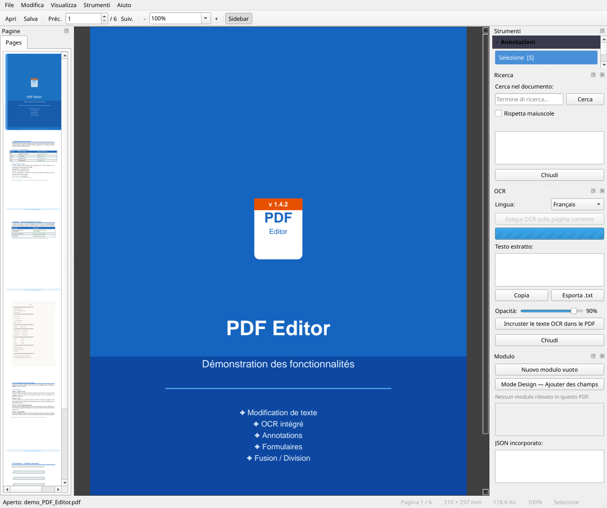
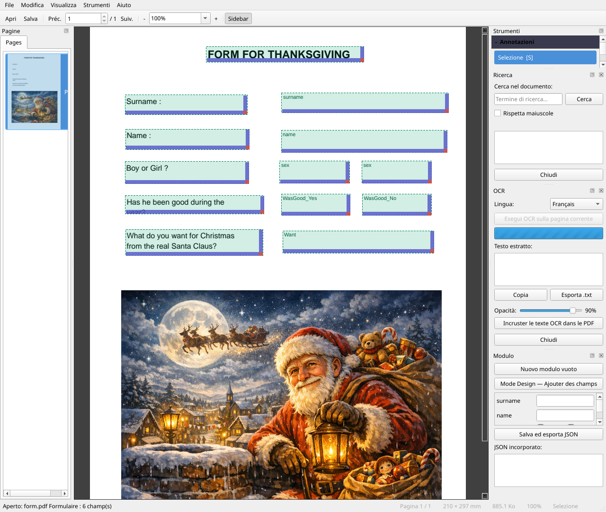
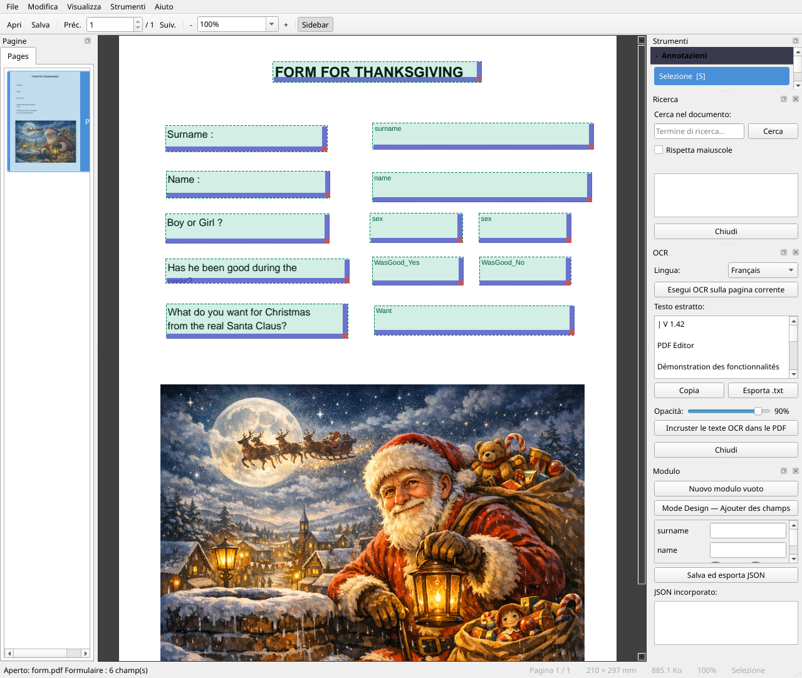
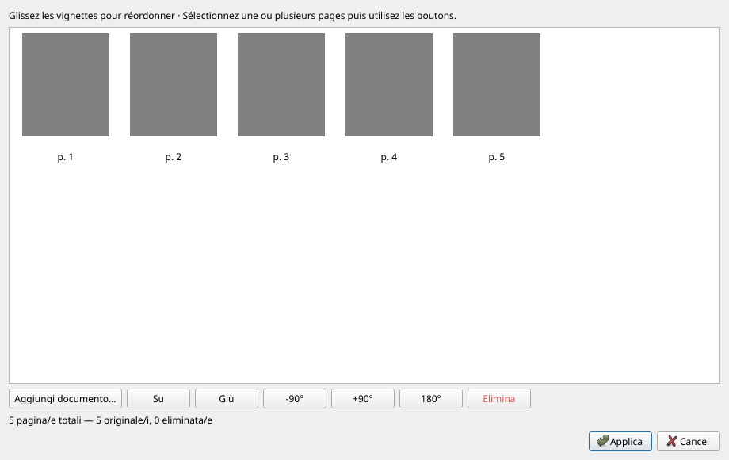
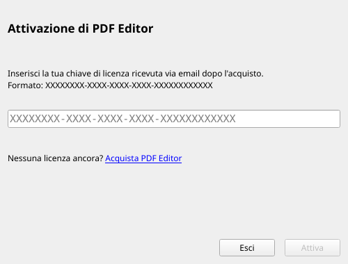
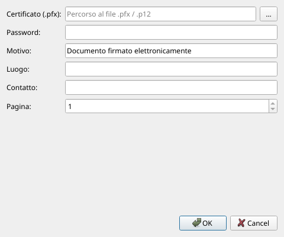

# Manuale utente — PDF Editor

**Versione 1.5.8** · 01/07/2026

---

## Indice

1. [Panoramica](#presentation)
2. [Installazione e primo avvio](#installation)
3. [Interfaccia generale](#interface)
4. [Preferenze](#preferences)
5. [Aprire e chiudere un documento](#ouvrir)
6. [Navigare nel documento](#navigation)
7. [Zoom e visualizzazione](#zoom)
8. [Modificare il testo esistente](#modifier-texte)
9. [Inserire testo](#inserer-texte)
10. [Annotazioni](#annotations)
11. [Inserire un'immagine](#inserer-image)
12. [Moduli PDF](#formulaires)
13. [Riconoscimento ottico dei caratteri (OCR)](#ocr)
14. [Gestione delle pagine — Riorganizzare / Unire / Dividere](#pages)
15. [Intestazioni e piè di pagina](#entetes)
16. [Filigrana](#filigrane)
17. [Timbro testo](#tampon-texte)
18. [Timbro immagine — logo e firma](#tampon-image)
19. [Integrazione Windows — clic destro](#windows)
20. [Metadati del documento](#metadata)
21. [Compressione PDF](#compression)
22. [Protezione con password](#protection)
23. [Firma digitale](#signature)
24. [Ricerca](#recherche)
25. [Estrazione contenuti](#extraction)
26. [Salvare il documento](#enregistrer)
27. [Annulla / Ripristina](#annuler)
28. [Temi e lingua](#langue)
29. [Scorciatoie da tastiera](#raccourcis)

---

> **Novità della v1.5.8**: menu **Strumenti** completamente organizzato in sotto-menu (*Inserisci / Organizza / Estrai / Proteggi / OCR*); modalità **scorrimento continuo** (`Ctrl+Maiusc+C`); **barra di ricerca integrata**; menu **Preferenze** centralizzato (`Modifica > Preferenze`) che raggruppa lingua, aiuto, licenza e integrazione Windows.
>
> **v1.5.0**: finestra **Preferenze**, **Aspetto**, **Schermo intero**, duplicazione pagina, modalità visualizzazione continua, ricerca integrata.
>
> **v1.4.1**: **Combina in PDF Editor** nel menu contestuale (selezione multi-file → finestra di riorganizzazione precaricata) · finestra *Integrazione Windows* rivista con due sezioni attivabili separatamente.
>
> **v1.4.0**: navigazione pagina precedente/successiva tramite scrollbar e rotella · estrazione testo con selezione intervallo pagine · popup di riepilogo dopo l'estrazione · pannello *Strumenti* allineato al menu Strumenti · migliorata la finestra *Informazioni*.
>
> **v1.3.0**: pannello laterale esteso (schede *Lingua* e *Aiuto*) · menu *Firma* inglobato in *Strumenti* · icone in tutti i menu · tutte le operazioni PDF registrate (`Ctrl+Z`).

---

<a name="presentation"></a>
## 1. Panoramica

**PDF Editor** è un editor PDF gratuito open source che permette di:

- Leggere e navigare qualsiasi file PDF
- Modificare il testo esistente direttamente nel documento
- Inserire testo, immagini e annotazioni
- Creare e compilare moduli PDF
- Applicare il Riconoscimento ottico dei caratteri (OCR) alle pagine scansionate
- Riorganizzare, unire e dividere documenti
- Assemblare un nuovo PDF da immagini (JPG, PNG, TIFF…)
- Aggiungere intestazioni, piè di pagina, filigrane e timbri
- Modificare metadati e comprimere il file
- Proteggere un documento con password
- Firmare digitalmente con un certificato `.pfx`

---

<a name="installation"></a>
## 2. Installazione e primo avvio

### Applicazione portatile

L'applicazione non richiede installazione. Fare doppio clic su `PDFEditor.exe` per avviarla.

### Installazione tramite installer

Se si dispone del file `PDFEditor-Setup.exe`, eseguirlo e seguire la procedura guidata.
Un passaggio offre di installare automaticamente **Tesseract OCR** (richiesto per il riconoscimento dei caratteri).

L'installer può inoltre **impostare PDF Editor come applicazione predefinita** per l'apertura dei file PDF (opzione selezionata per difetto).

### Primo avvio — Tesseract OCR

Al primo avvio, se Tesseract non viene rilevato sul computer, compare una finestra che propone di scaricarlo e installarlo automaticamente (~50 MB).

- **Lingua OCR**: selezionare la lingua principale dei documenti (il sistema rileva automaticamente la lingua di Windows).
- L'**inglese** è sempre incluso come lingua di fallback.
- È possibile rifiutare l'installazione; la funzione OCR risulterà semplicemente non disponibile finché Tesseract non viene installato manualmente.

---

<a name="interface"></a>
## 3. Interfaccia generale


```
┌─────────────────────────────────────────────────────────────────┐
│  Menu  (File · Modifica · Visualizza · Strumenti · Aiuto)       │
├─────────────────────────────────────────────────────────────────┤
│  Barra principale  (◀ Prec. | N. pag. / totale | Succ. ▶ | Zoom)│
├─────────────────────────────────────────────────────────────────┤
│  Barra pagine  (Riorganizza/Unisci · Dividi · Elimina …)        │
├─────────────────────────────────────────────────────────────────┤
│  Barra annotazioni  (Seleziona · Modifica testo · Evidenzia · …)│
├──────────────────────┬──────────────────────────────────────────┤
│                      │                                          │
│  Pannello laterale   │         Visualizzatore PDF               │
│  [Pagine]            │         (pagina corrente)                │
│  [Strumenti]         │                                          │
│                      │          — oppure —                      │
│                      │                                          │
│                      │         Visualizzatore continuo          │
│                      │         (scorrimento verticale)          │
│                      │                                          │
├──────────────────────┴──────────────────────────────────────────┤
│  Barra di stato                                                 │
└─────────────────────────────────────────────────────────────────┘
```

- **Pannello laterale sinistro**: due schede — *Pagine* e *Strumenti*. Può essere nascosto con `F4`.
- **Visualizzatore**: visualizzazione pagina singola per impostazione predefinita, oppure modalità *scorrimento continuo* (`Visualizza → Scorrimento continuo`, `Ctrl+Maiusc+C`).
- **Barra di ricerca**: appare in cima all'area di lettura (`Ctrl+F`) e si chiude con `Esc`.
- **Barra di stato**: messaggi contestuali, numero di pagina, indicatore di modifiche non salvate (`*`).

### Schede del pannello laterale

| Scheda | Contenuto |
|--------|-----------|
| **Pagine** | Miniature di navigazione — cliccare per andare a una pagina |
| **Strumenti** | Sezione *Strumenti* (stesso ordine del menu) · sezione *Annotazioni* · sezione *Scorciatoie* |

### Barra dei menu in alto

| Menu | Contenuto principale |
|------|----------------------|
| **File** | Apri, Salva, Stampa, Esci |
| **Modifica** | Annulla, Ripristina, Cerca, **Preferenze** |
| **Visualizza** | Zoom, Pannello, Scorrimento continuo, Schermo intero, Tema, Aspetto |
| **Strumenti** | Azioni raggruppate in sotto-menu: *Inserisci*, *Organizza*, *Estrai*, *Proteggi*, *OCR* |
| **Aiuto** | Manuale, Scorciatoie, Segnala un bug, Controlla aggiornamenti, Informazioni |

> Lingua, licenza, integrazione Windows e aspetto sono ora centralizzati in **Modifica > Preferenze**.

---

<a name="preferences"></a>
## 4. Preferenze

Tutte le impostazioni dell'applicazione sono raggruppate in un'unica finestra accessibile tramite **Modifica → Preferenze** (`Ctrl+,`):

| Scheda | Contenuto |
|--------|-----------|
| **Lingua** | Scegliere la lingua dell'interfaccia (viene offerto il riavvio) |
| **Aiuto e scorciatoie** | Accesso al manuale e al riepilogo delle scorciatoie |
| **Licenza e integrazione** | Gestione licenza, integrazione Windows (clic destro) |
| **Aspetto** | Tema e personalizzazione colori |

> Lingua, aiuto e integrazione Windows non si trovano più in schede separate del pannello laterale — sono raggruppate qui.

---

<a name="ouvrir"></a>
## 5. Aprire e chiudere un documento

| Azione | Metodo |
|--------|--------|
| Aprire un PDF | *File → 📂 Apri…* oppure `Ctrl+O` |
| Aprire da Esplora risorse | Trascinare il file sulla finestra |
| Aprire da riga di comando | `PDFEditor.exe mio_documento.pdf` |
| Chiudere il documento | *File → ✖ Chiudi* oppure `Ctrl+W` |

Se il documento presenta modifiche non salvate, viene richiesta una conferma prima della chiusura.

### Documenti protetti da password

All'apertura di un file crittografato, una finestra richiede la password utente. Per accedere alle opzioni di modifica avanzate, potrebbe essere necessaria la **password proprietario**.

---

<a name="navigation"></a>
## 6. Navigare nel documento

| Azione | Metodo |
|--------|--------|
| Pagina successiva | Cliccare **Succ. ▶** oppure `→` |
| Pagina precedente | Cliccare **◀ Prec.** oppure `←` |
| Andare a una pagina specifica | Inserire il numero nel campo e premere `Invio` |
| Scorrere nella pagina | Rotella del mouse o scrollbar di destra |
| Pagina successiva (rotella) | Scorrere in basso alla **fine della pagina** |
| Pagina precedente (rotella) | Scorrere in alto all'**inizio della pagina** |
| Pagina successiva (scrollbar) | Trascinare la scrollbar fino in fondo |
| Cliccare una miniatura | Pannello laterale sinistro — scheda *Pagine* |
| **Scorrimento continuo** | `Visualizza → Scorrimento continuo` oppure `Ctrl+Maiusc+C` |
| Doppio clic in modalità continua | Tornare alla visualizzazione pagina singola alla pagina cliccata |

---

<a name="zoom"></a>
## 7. Zoom e visualizzazione

| Azione | Metodo |
|--------|--------|
| Zoom avanti | `Ctrl+=` oppure pulsante **+** |
| Zoom indietro | `Ctrl+-` oppure pulsante **−** |
| Adatta pagina | `Ctrl+0` |
| Adatta larghezza | `Ctrl+1` |
| Zoom personalizzato | Inserire una percentuale nell'elenco a discesa |
| Zoom con il mouse | `Ctrl + rotella` |

---

<a name="modifier-texte"></a>
## 8. Modificare il testo esistente




PDF Editor consente di modificare il testo direttamente nel flusso del documento.

### Passaggi

1. Nella barra delle annotazioni, selezionare lo strumento **Modifica testo** (`T`).
2. **Doppio clic** sulla parola o sul blocco di testo da modificare.
3. Compare una finestra popup con il testo e le opzioni di formattazione:
   - Carattere, dimensione, **Grassetto**, *Corsivo*, colore, spaziatura lettere
   - Colore di sfondo (trasparente per impostazione predefinita)
4. Modificare il testo, regolare la formattazione, quindi cliccare **Conferma** (`Ctrl+Invio`).

> **Suggerimento**: lo strumento tenta innanzitutto una modifica **in loco** nel flusso PDF. Se ciò non è possibile (carattere sconosciuto, testo in immagine), ricorre a un'annotazione di sostituzione.
>
> Se la modifica non può essere applicata (carattere non modificabile, testo in immagine, blocco vuoto, fallimento injection nel flusso), compare un **messaggio persistente** nella **barra di stato** in basso alla finestra (es.: *"Impossibile modificare: modifica in loco fallita…"*).

### Annulla

`Ctrl+Z` per annullare · `Ctrl+Y` per ripristinare (vedere [§27 Annulla / Ripristina](#annuler)).

---

<a name="inserer-texte"></a>
## 9. Inserire testo

Per aggiungere un nuovo blocco di testo in un'area vuota:

1. Selezionare lo strumento **Modifica testo** (`T`).
2. **Doppio clic** su un'area vuota della pagina.
3. Si apre la finestra popup con un editor vuoto.
4. Digitare il testo, scegliere la formattazione, quindi confermare.

Il testo viene inserito come annotazione **FreeText** permanente nel PDF.

---

<a name="annotations"></a>
## 10. Annotazioni

La barra delle annotazioni mette a disposizione diversi strumenti:

| Strumento | Scorciatoia | Uso |
|-----------|-------------|-----|
| Selezione | `S` | Selezionare e spostare annotazioni esistenti |
| Modifica testo | `T` | Modificare il testo del documento (vedere §8 e §9) |
| Evidenzia | `H` | Evidenziare in giallo una parola o una selezione |
| Commento | `C` | Aggiungere una nota (fumetto) sulla pagina |
| Immagine | `I` | Inserire un'immagine (vedere §11) |
| Cancella | `E` | Eliminare un'annotazione cliccandola |

Gli stessi strumenti sono disponibili nella scheda **Strumenti** del pannello laterale sinistro, sezione *Annotazioni* (compressa per impostazione predefinita — cliccare per espandere).

### Spessore linea

Nel pannello *Strumenti → Annotazioni*, il campo **Spessore** imposta lo spessore del tratto per le annotazioni di disegno (da 0,5 a 10 pt).

### Ridimensionare / spostare un'annotazione

In modalità **Selezione** (`S`):
- **Clic** su un'annotazione per selezionarla (appaiono le maniglie).
- **Trascinare** per spostare · **Trascinare una maniglia** per ridimensionare.
- Tasto `Canc` per eliminare l'annotazione selezionata.

---

<a name="inserer-image"></a>
## 11. Inserire un'immagine

**Metodo 1 — Menu**
1. *Strumenti → Inserisci → 🖼 Inserisci immagine…*
2. Scegliere il file immagine (PNG, JPEG, BMP, WebP…).
3. Disegnare l'area di destinazione sulla pagina.

**Metodo 2 — Barra degli strumenti**
1. Cliccare **🖼 Inserisci immagine** nella barra *Pagine & Modulo*.
2. Stessa procedura.

**Metodo 3 — Pannello Strumenti**
1. Scheda **Strumenti** del pannello laterale → *🖼 Inserisci immagine…*

L'immagine viene incorporata in modo permanente nel PDF.

---

<a name="formulaires"></a>
## 12. Moduli PDF




### Attivare la modalità progetto

Cliccare **✏ Modalità progetto** nella barra *Pagine & Modulo*.
In modalità progetto, il clic-trascina sulla pagina crea un nuovo campo.

### Tipi di campo disponibili

| Tipo | Descrizione |
|------|-------------|
| Testo | Campo di inserimento libero |
| Casella di controllo | Sì / No |
| Menu a discesa | Scelta tra opzioni predefinite |
| Pulsanti di opzione | Selezione esclusiva in un gruppo |
| Etichetta | Testo statico non modificabile |

### Compilare un modulo

In modalità normale (progetto disattivato), cliccare un campo per compilarlo.
Il pannello laterale elenca tutti i campi con i relativi valori.

### Spostare un campo

*Strumenti → ↔ Sposta blocco di testo* (`M`), quindi trascinare il campo.

---

<a name="ocr"></a>
## 13. Riconoscimento ottico dei caratteri (OCR)




**Prerequisito**: Tesseract OCR installato (vedere [§2](#installazione)). Nella versione Windows installata, Tesseract è incluso.

### Eseguire l'OCR

1. *Strumenti → OCR → 🔤 Riconoscimento caratteri (OCR)…*
2. Si apre il pannello OCR a destra.
3. Selezionare la **lingua** del documento.
4. Cliccare **Esegui OCR**.

### Risultato

- Il testo riconosciuto viene visualizzato in sovrapposizione con blocchi colorati.
- Regolare dimensione/posizione di ogni blocco tramite drag-and-drop.
- Cliccare **Incorpora nel PDF** per rendere il testo permanente.

> I blocchi OCR incorporati sono invisibili a schermo ma indicizzabili dai lettori PDF (`Ctrl+F`, copia-incolla…).

### Opzioni OCR aggiuntive

| Opzione | Descrizione |
|---------|-------------|
| *Strumenti → OCR → Ricostruisci pagina con testo nativo* | Sostituisce gli elementi di testo della pagina con testo PDF nativo (migliore qualità di modifica). |
| *Strumenti → OCR → Applica correzione come patch immagine* | Corregge il testo OCR modificando direttamente l'immagine della pagina (sperimentale). |

### Correggere una riga OCR con doppio clic

Su un PDF scansionato che contiene già un livello OCR (ad esempio dopo aver cliccato **Incorpora nel PDF**), è possibile correggere una riga direttamente dal visualizzatore:

1. Assicurarsi che lo strumento attivo sia **Modifica testo** (`T`) o **Selezione** (`S`).
2. **Doppio clic** sulla riga di testo scansionata da correggere.
3. Appare un campo di modifica **in linea** (senza finestra popup) al posto della riga.
4. Correggere il testo.
5. Premere **Invio** per confermare, oppure **Esc** per annullare.

> La correzione viene salvata come annotazione OCR invisibile, indicizzabile dalla ricerca (`Ctrl+F`) e dal copia-incolla. Questa operazione è **annullabile** tramite `Ctrl+Z`.

> **Suggerimento**: il doppio clic è il modo più rapido per correggere un errore di battitura in una scansione. Se la riga non viene riconosciuta al clic, eseguire prima *Strumenti → OCR → Riconoscimento caratteri (OCR)…* e poi cliccare **Incorpora nel PDF**.

---

<a name="pages"></a>
## 14. Gestione delle pagine — Riorganizzare / Unire / Dividere




### Riorganizzare e unire pagine

*Strumenti → Organizza → ⊕ Riorganizza/Unisci pagine…* (o il pulsante **⊕ Riorganizza/Unisci** nella barra degli strumenti)

Questo strumento versatile funziona **con o senza un documento aperto**:

| Situazione | Risultato |
|------------|-----------|
| PDF aperto | Riorganizza le pagine del documento corrente |
| Nessun PDF aperto | Crea un nuovo PDF da zero |

#### Interfaccia dell'organizzatore

- Le pagine sono visualizzate come **miniature** che possono essere riordinate tramite drag-and-drop.
- Selezionare una o più miniature, quindi utilizzare i pulsanti:

| Pulsante | Azione |
|----------|--------|
| ▲ Su / ▼ Giù | Sposta la selezione |
| ↺ -90° / ↻ +90° / ↕ 180° | Ruota le pagine selezionate |
| 🗑 Elimina | Rimuove le pagine selezionate |
| ➕ Aggiungi documento… | Inserisce pagine da un altro documento |

#### Aggiungere un documento

Il pulsante **➕ Aggiungi documento…** accetta:
- **PDF** — vengono aggiunte tutte le pagine
- **Immagini**: JPG, JPEG, PNG, BMP, TIFF (anche multi-pagina), WebP — ogni immagine diventa una pagina

> **Suggerimento**: per **unire** più PDF, aprire l'organizzatore senza un documento aperto, aggiungere i file tramite "Aggiungi documento", ordinarli, quindi cliccare **Applica** — una finestra "Salva con nome" chiederà il nome del nuovo PDF.

> Questa operazione è **annullabile** tramite `Ctrl+Z`.

### Duplicare la pagina corrente

*Strumenti → Organizza → Duplica pagina corrente* oppure `Ctrl+Maiusc+P`.

> Questa operazione è **annullabile** tramite `Ctrl+Z`.

### Eliminare la pagina corrente

*Strumenti → Organizza → 🗑 Elimina pagina corrente* oppure `Ctrl+Canc`.

> Questa operazione è **annullabile** tramite `Ctrl+Z`.

### Rotazione rapida della pagina corrente

| Azione | Metodo |
|--------|--------|
| Ruota +90° | *Strumenti → Organizza → ↻ Ruota pagina (+90°)* oppure `R` |
| Ruota -90° | *Strumenti → Organizza → ↺ Ruota pagina (-90°)* oppure `Maiusc+R` |

### Dividere questo PDF

1. *Strumenti → Organizza → ✂ Dividi questo PDF…*
2. Inserire il numero di **pagine per file** (ad es. `1` = un file per pagina, `5` = gruppi di 5 pagine).
3. Un'anteprima mostra quanti file verranno creati.
4. Scegliere la cartella di destinazione e confermare.

---

<a name="entetes"></a>
## 15. Intestazioni e piè di pagina

*Strumenti → ☰ Intestazioni e piè di pagina…*

Aggiunge automaticamente testo in alto e/o in basso su ogni pagina.

### Zone di testo

Ogni zona (Intestazione e Piè di pagina) ha tre colonne: **Sinistra · Centro · Destra**.

### Token dinamici

Inserire variabili che verranno sostituite automaticamente all'applicazione:

| Token | Valore inserito |
|-------|-----------------|
| `{page}` | Numero di pagina corrente |
| `{total}` | Numero totale di pagine |
| `{date}` | Data odierna (gg/mm/aaaa) |

I pulsanti di scelta rapida sotto ogni campo consentono di inserire questi token con un clic.

### Opzioni comuni

| Opzione | Descrizione |
|---------|-------------|
| Dimensione font | Da 6 a 36 pt |
| Colore | Nero, Grigio, Rosso, Blu |
| Margine dal bordo | Distanza in mm dal bordo della pagina |
| Non applicare sulla 1ª pagina | Utile per le pagine di copertina |

### Modificare o rimuovere

Riaprire *Strumenti → ☰ Intestazioni e piè di pagina…*: vengono ricaricate le ultime impostazioni utilizzate.
- **Modificare**: cambiare i testi e cliccare nuovamente **Applica** — le vecchie intestazioni vengono sostituite.
- **Rimuovere**: cancellare tutti i campi e cliccare **Applica** — le intestazioni/i piè di pagina vengono eliminati.

> Questa operazione è **annullabile** tramite `Ctrl+Z`.

---

<a name="filigrane"></a>
## 16. Filigrana

*Strumenti → ◈ Filigrana…*

Applica un testo diagonale su tutte le pagine del documento.

| Opzione | Descrizione |
|---------|-------------|
| Testo | Etichetta della filigrana (es. `CONFIDENZIALE`) |
| Dimensione | Da 10 a 150 pt |
| Colore | Grigio, Rosso, Blu, Verde, Nero |
| Opacità | Da 5 % (molto trasparente) a 100 % (opaca) |

> La filigrana è incorporata nel contenuto PDF — appare anche in stampa.

> Questa operazione è **annullabile** tramite `Ctrl+Z`.

---

<a name="tampon-texte"></a>
## 17. Timbro testo

*Strumenti → Inserisci → 🖊 Timbro testo…*

Applica un "sigillo" in stile timbro (testo incorniciato) su una o più pagine.

### Timbri disponibili

| Timbro | Colore |
|--------|--------|
| APPROVATO | Verde |
| RIFIUTATO | Rosso |
| DA FIRMARE | Blu |
| RISERVATO | Rosso |
| BOZZA | Grigio |
| URGENTE | Arancione |
| COPIA | Grigio |
| DA RIVEDERE | Arancione |
| Personalizzato… | Qualsiasi colore (testo libero) |

### Opzioni

| Opzione | Descrizione |
|---------|-------------|
| Posizione | In alto a destra, In alto a sinistra, In basso a destra, In basso a sinistra, Centro |
| Pagine | Tutte le pagine, Prima pagina, Ultima pagina |
| Rotazione | Orizzontale (0°) o Diagonale (−45°) |
| Opacità | Da 10 % a 100 % |

Un'**anteprima in tempo reale** viene visualizzata a destra della finestra di dialogo.

> Questa operazione è **annullabile** tramite `Ctrl+Z`.

---

<a name="tampon-image"></a>
## 18. Timbro immagine — logo e firma

*Strumenti → Inserisci → 🖼 Timbro immagine…*

Applica un'immagine (logo aziendale, firma scansionata, sigillo…) su una o più pagine. I timbri aggiunti vengono **salvati da sessione a sessione** in una libreria personale.

### Libreria timbri

La libreria è archiviata in `~/.pdf_editor/stamps/`. È vuota al primo avvio.

| Pulsante | Azione |
|----------|--------|
| ➕ Aggiungi… | Importa un'immagine (PNG, JPG, BMP, WebP, TIFF) e le assegna un nome |
| 🗑 Elimina | Rimuove il timbro selezionato dalla libreria |

### Opzioni

| Opzione | Descrizione |
|---------|-------------|
| Posizione | In basso a destra, In basso a sinistra, In alto a destra, In alto a sinistra, Centro |
| Pagine | Tutte le pagine, Prima pagina, Ultima pagina |
| Dimensione | Percentuale della larghezza della pagina (5 % a 100 %) |
| Opacità | Da 10 % a 100 % |

> **Trasparenza**: le immagini PNG con sfondo trasparente (firme, logo) mantengono la trasparenza nel PDF.

Un'**anteprima in tempo reale** viene visualizzata a destra della finestra di dialogo.

> Questa operazione è **annullabile** tramite `Ctrl+Z`.

---

<a name="windows"></a>
## 19. Integrazione Windows — clic destro




*Modifica → Preferenze → Licenza e integrazione → Integrazione Windows (clic destro)…*

PDF Editor offre due voci nel menu contestuale di Esplora risorse di Windows, entrambe **attivate automaticamente** al primo avvio. Sono gestite tramite *Modifica → Preferenze → Licenza e integrazione*.

### Voci del menu contestuale

| Voce | Azione |
|------|--------|
| **Apri con PDF Editor** | Apre il file selezionato nell'applicazione. |
| **Combina in PDF Editor** | Selezione multi-file → apre la finestra di riorganizzazione precaricata con i PDF selezionati, pronti per l'unione. |

### Convertire un'immagine in PDF

Converte un file immagine in PDF con un solo clic destro (elaborazione in background, nessuna interfaccia).

**Utilizzo**

1. Fare clic destro su un file immagine in Esplora risorse.
2. Selezionare **Converti in PDF - PDF EDITOR**.
3. Il PDF viene creato nella **stessa cartella**, con lo stesso nome base (`.pdf`).
4. Alla fine compare una conferma.

**Formati**: JPG · JPEG · PNG · BMP · TIFF · TIF · WebP

> Se esiste già un PDF con lo stesso nome, viene aggiunto un suffisso numerico (`file_1.pdf`, `file_2.pdf`…).

---

### Combinare file in PDF Editor

Apre la finestra **Riorganizza/Unisci** con diversi file precaricati. Ideale per assemblare rapidamente PDF e/o immagini in un unico documento.

**Utilizzo**

1. In Esplora risorse di Windows, **selezionare più file** (Ctrl+clic o Maiusc+clic).
2. **Clic destro** sulla selezione.
3. Scegliere **Combina in PDF Editor**.
4. PDF Editor si apre e mostra la finestra di riorganizzazione con tutti i file precaricati come miniature.
5. Riordinare le pagine come necessario, quindi cliccare **Applica** e salvare.

**Formati supportati**: PDF · JPG · JPEG · PNG · BMP · TIFF · TIF · WebP

> La voce compare anche quando si fa clic destro su un singolo file compatibile.
> Le immagini vengono automaticamente convertite in PDF temporanei prima di essere mostrate nella finestra.

---

<a name="metadata"></a>
## 20. Metadati del documento

*Strumenti → ℹ Metadati…*

Visualizzare e modificare le informazioni memorizzate nel file PDF:

| Campo | Descrizione |
|-------|-------------|
| Titolo | Titolo del documento |
| Autore | Nome dell'autore |
| Oggetto | Tema o breve descrizione |
| Parole chiave | Parole chiave separate da virgole |
| Applicazione | Software che ha creato il documento |

Questi metadati sono visibili nelle proprietà del file (Esplora risorse di Windows, lettori PDF).

> Questa operazione è **annullabile** tramite `Ctrl+Z`.

---

<a name="compression"></a>
## 21. Compressione PDF

*Strumenti → ⚡ Comprimi PDF*

Riduce le dimensioni del file ottimizzando i flussi interni del PDF (compressione oggetti e ricompressione dei dati esistenti).

- La compressione viene applicata **immediatamente** al documento aperto.
- Un messaggio in basso allo schermo indica la riduzione ottenuta (in KB o MB).
- Ricordarsi di salvare (`Ctrl+S`) per conservare il risultato.

> L'effetto è più evidente su PDF non ottimizzati (esportazioni Word, scansioni…). I PDF già compressi mostreranno poca differenza.

> Questa operazione è **annullabile** tramite `Ctrl+Z`.

---

<a name="protection"></a>
## 22. Protezione con password

### Proteggere un documento

1. *Strumenti → Proteggi → 🔒 Proteggi con password…*
2. Inserire una password **utente** (lettura) e/o **proprietario** (modifica).
3. Confermare — il documento verrà crittografato e salvato in un nuovo file.

### Rimuovere la protezione

1. Aprire il documento con la password proprietario.
2. *Strumenti → Proteggi → 🔓 Rimuovi protezione…*
3. La protezione viene rimossa e salvata in un nuovo file.

---

<a name="signature"></a>
## 23. Firma digitale




PDF Editor può firmare un documento con un certificato digitale `.pfx` / `.p12`.

### Accesso

- Tramite il menu: *Strumenti → Proteggi → ✍ Firma documento…*
- Tramite il pannello laterale: scheda **Strumenti** → *✍ Firma documento…*

### Firmare

1. *Strumenti → Proteggi → ✍ Firma documento…*
2. Compilare:
   - **Percorso certificato**: file `.pfx` o `.p12`
   - **Password** del certificato
   - **Motivo** e **Luogo** (opzionali)
   - **Pagina** in cui posizionare la firma visibile
3. Cliccare **OK**.

### Verificare le firme

*Strumenti → Proteggi → 🔎 Verifica firme…* (o il pulsante *🔎 Verifica firme…* nel pannello Strumenti) mostra l'elenco delle firme e il loro stato di validità.

### Ottenere un certificato `.pfx`

*Aiuto → 🔑 Come ottenere un certificato .pfx?* spiega le opzioni:
- Certificato di un'Autorità di Certificazione (Certum, Sectigo, GlobalSign…)
- Certificato auto-firmato con OpenSSL (solo uso interno)

---

<a name="recherche"></a>
## 24. Ricerca

1. *Modifica → 🔍 Cerca…* oppure `Ctrl+F`.
2. Compare una **barra di ricerca integrata** in cima al visualizzatore.
3. Inserire il termine da cercare.
4. Le occorrenze vengono evidenziate; utilizzare **Precedente / Successiva** per navigare.
5. Premere `Esc` o cliccare ✕ per chiudere la barra.

---

<a name="extraction"></a>
## 25. Estrazione contenuti

### Estrarre testo

*Strumenti → Estrai → 📄 Estrai testo…* (o pulsante nel pannello *Strumenti*)

Una finestra consente di scegliere le pagine da estrarre:

| Opzione | Descrizione |
|---------|-------------|
| **Tutte le pagine** | Estrae il testo dall'intero documento |
| **Pagina corrente (N)** | Estrae solo la pagina visualizzata |
| **Intervallo** | Inserire un intervallo *Dalla pagina X alla Y* |

Dopo aver confermato il file di destinazione, viene visualizzato un **riepilogo**:
- Pagine estratte
- Numero di caratteri, parole e righe
- Dimensione del file generato

### Estrarre immagini

*Strumenti → Estrai → 🖼 Estrai immagini…* → scegliere una cartella di destinazione.

Tutte le immagini incorporate nel PDF vengono estratte nella cartella scelta.

---

<a name="enregistrer"></a>
## 26. Salvare il documento

| Azione | Scorciatoia |
|--------|-------------|
| Salva | `Ctrl+S` |
| Salva con nome… | `Ctrl+Maiusc+S` |

> Il titolo della finestra mostra un asterisco `*` quando il documento ha modifiche non salvate.

---

<a name="annuler"></a>
## 27. Annulla / Ripristina

PDF Editor dispone di una cronologia completa delle modifiche che consente di annullare o ripristinare tutte le operazioni.

| Scorciatoia | Azione |
|-------------|--------|
| `Ctrl+Z` | Annulla l'ultima operazione |
| `Ctrl+Y` | Ripristina |

La cronologia è accessibile anche tramite *Modifica → ↩ Annulla* e *Modifica → ↪ Ripristina*.

### Operazioni annullabili

| Operazione | Annullabile |
|------------|-------------|
| Aggiungere un'annotazione | ✅ |
| Spostare un blocco di testo | ✅ |
| Rotazione pagina | ✅ |
| Filigrana | ✅ |
| Intestazioni / piè di pagina | ✅ |
| Timbro testo | ✅ |
| Timbro immagine | ✅ |
| Compressione PDF | ✅ |
| Metadati | ✅ |
| Riorganizzare / unire pagine | ✅ |
| Eliminare una pagina | ✅ |
| Proteggi / rimuovi protezione | ❌ (crea un nuovo file) |
| Firma | ❌ (operazione irreversibile) |
| Dividi | ❌ (crea nuovi file) |

> La cronologia viene cancellata quando si apre un nuovo documento.

---

<a name="langue"></a>
## 28. Temi e lingua

### Tema

*Visualizza → Tema scuro* — attiva/disattiva il tema scuro con un semplice interruttore (salvato nelle preferenze).

*Visualizza → Aspetto…* apre la finestra dell'aspetto per impostazioni più dettagliate.

### Lingua dell'interfaccia

**Metodo principale**: *Modifica → Preferenze → Lingua*, quindi scegliere la lingua desiderata.

Viene offerto un riavvio per applicare la modifica. Le lingue disponibili sono:

| Codice | Lingua |
|--------|--------|
| 🇫🇷 `fr` | Français |
| 🇬🇧 `en` | English |
| 🇩🇪 `de` | Deutsch |
| 🇪🇸 `es` | Español |
| 🇮🇹 `it` | Italiano |
| 🇵🇹 `pt` | Português |
| 🇷🇺 `ru` | Русский |

### Aiuto e supporto

*Aiuto* offre accesso rapido a:
- **📖 Manuale utente** (equivalente a `F1`)
- **🐛 Segnala un bug…** — apre il modulo di segnalazione bug
- **💡 Suggerisci un miglioramento…** — apre il modulo di suggerimento
- **🔄 Controlla aggiornamenti…**
- L'elenco principale delle **scorciatoie da tastiera**

L'integrazione Windows (clic destro) si configura ora da *Modifica → Preferenze → Licenza e integrazione* (vedere [§19](#windows)).

### Informazioni

*Aiuto → ℹ Informazioni* mostra la versione, le tecnologie utilizzate e il link di supporto.

---

<a name="raccourcis"></a>
## 29. Scorciatoie da tastiera

### File

| Scorciatoia | Azione |
|-------------|--------|
| `Ctrl+O` | Apri un file |
| `Ctrl+S` | Salva |
| `Ctrl+Maiusc+S` | Salva con nome |
| `Ctrl+P` | Stampa |
| `Ctrl+W` | Chiudi il documento |
| `Alt+F4` | Esci |

### Modifica

| Scorciatoia | Azione |
|-------------|--------|
| `Ctrl+Z` | Annulla |
| `Ctrl+Y` | Ripristina |
| `Ctrl+F` | Cerca (barra integrata) |
| `Ctrl+,` | Preferenze |

### Navigazione

| Scorciatoia | Azione |
|-------------|--------|
| `←` | Pagina precedente |
| `→` | Pagina successiva |
| `Ctrl+Maiusc+C` | Attiva/disattiva scorrimento continuo |

### Visualizzazione

| Scorciatoia | Azione |
|-------------|--------|
| `Ctrl+=` | Zoom avanti |
| `Ctrl+-` | Zoom indietro |
| `Ctrl+0` | Adatta pagina |
| `Ctrl+1` | Adatta larghezza |
| `F4` | Mostra/nascondi pannello laterale (Pagine/Strumenti) |
| `F5` | Mostra/nascondi barra degli strumenti |
| `F11` | Schermo intero |

### Strumenti

| Scorciatoia | Azione |
|-------------|--------|
| `S` | Strumento Selezione |
| `T` | Strumento Modifica testo |
| `H` | Strumento Evidenzia |
| `C` | Strumento Commento |
| `I` | Strumento Immagine |
| `E` | Strumento Cancella |
| `M` | Sposta blocco di testo |
| `R` | Ruota pagina +90° |
| `Maiusc+R` | Ruota pagina -90° |
| `Ctrl+Canc` | Elimina pagina corrente |
| `Ctrl+Maiusc+P` | Duplica pagina corrente |
| `F1` | Manuale utente |

---

*Manuale aggiornato il 01/07/2026 — PDF Editor v1.5.8*  
