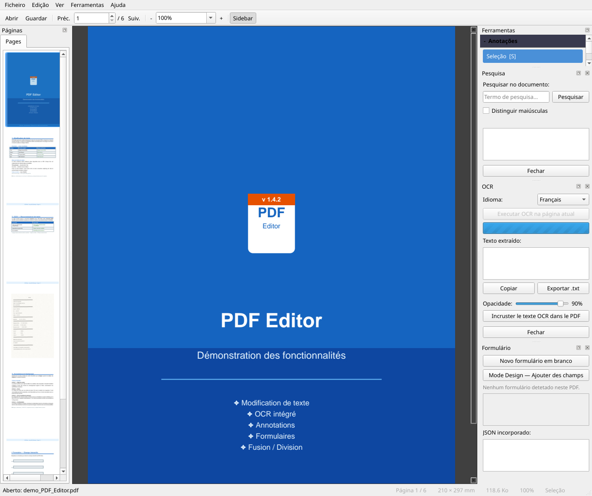
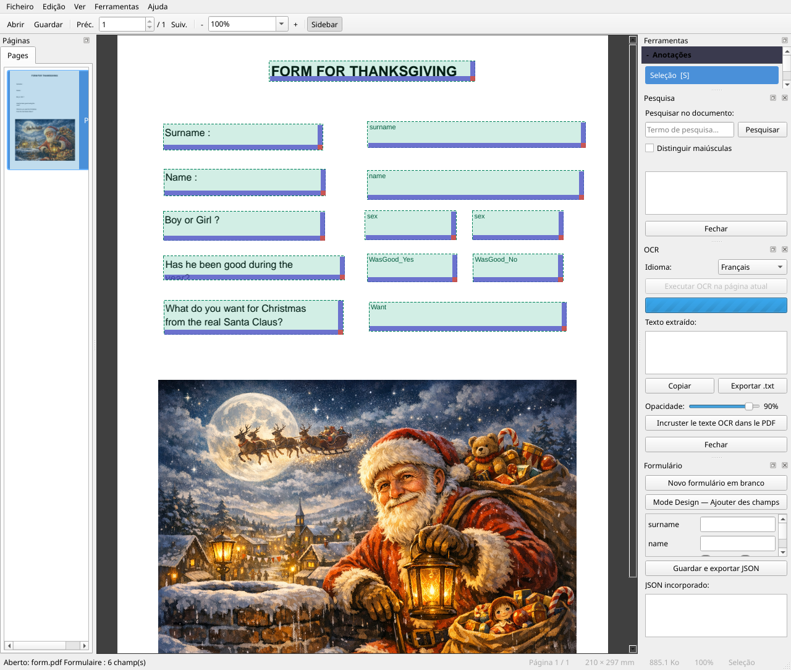
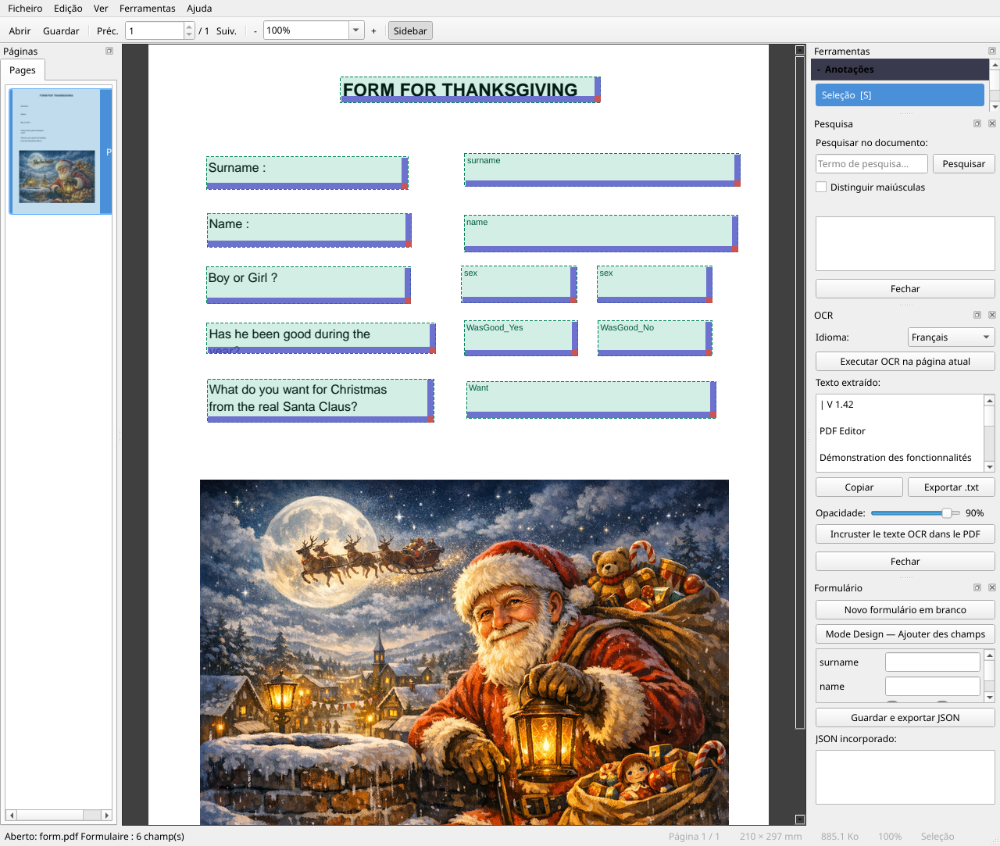
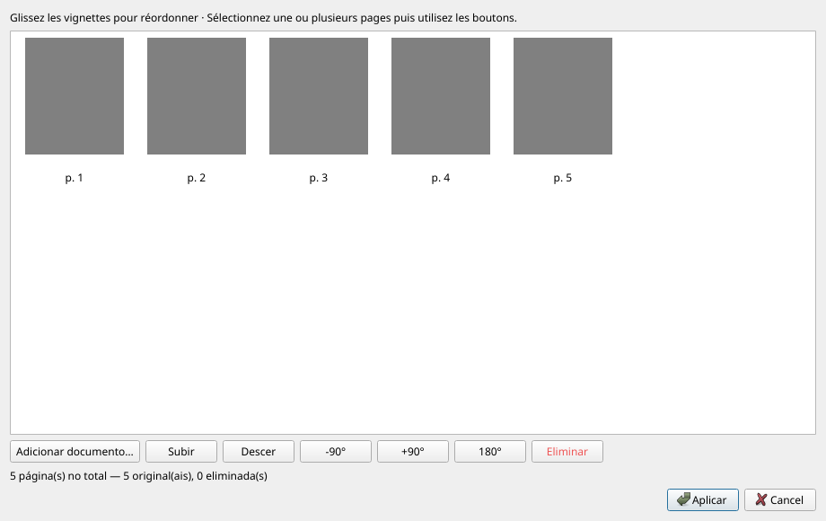
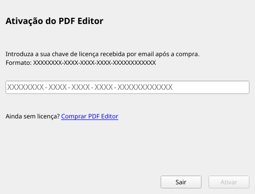
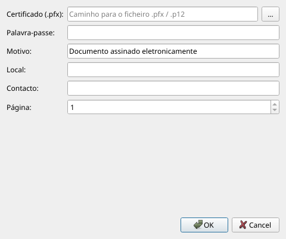

# Manual do Utilizador — PDF Editor

**Versão 1.5.8** · 01/07/2026

---

## Índice

1. [Visão geral](#presentation)
2. [Instalação e primeira execução](#installation)
3. [Interface geral](#interface)
4. [Preferências](#preferences)
5. [Abrir e fechar um documento](#ouvrir)
6. [Navegar no documento](#navigation)
7. [Zoom e apresentação](#zoom)
8. [Editar texto existente](#modifier-texte)
9. [Inserir texto](#inserer-texte)
10. [Anotações](#annotations)
11. [Inserir uma imagem](#inserer-image)
12. [Formulários PDF](#formulaires)
13. [Reconhecimento ótico de caracteres (OCR)](#ocr)
14. [Gestão de páginas — Reorganizar / Juntar / Dividir](#pages)
15. [Cabeçalhos e rodapés](#entetes)
16. [Marca de água](#filigrane)
17. [Carimbo de texto](#tampon-texte)
18. [Carimbo de imagem — logótipo e assinatura](#tampon-image)
19. [Integração Windows — clique direito](#windows)
20. [Metadados do documento](#metadata)
21. [Compressão de PDF](#compression)
22. [Proteção por palavra-passe](#protection)
23. [Assinatura digital](#signature)
24. [Pesquisa](#recherche)
25. [Extrair conteúdo](#extraction)
26. [Guardar o documento](#enregistrer)
27. [Desfazer / Refazer](#annuler)
28. [Temas e idioma](#langue)
29. [Atalhos de teclado](#raccourcis)

---

> **Novo na v1.5.8**: menu **Ferramentas** totalmente organizado em sub-menus (*Inserir / Organizar / Extrair / Segurança / OCR*); modo de **scroll contínuo** (`Ctrl+Maj+C`); **barra de pesquisa em linha**; menu centralizado de **Preferências** (`Edição > Preferências`) agrupando idioma, ajuda, licença e integração Windows.
>
> **v1.5.0**: caixa de diálogo **Preferências**, **Aspeto**, **Ecrã completo**, duplicação de páginas, modo de visualização contínua, pesquisa em linha.
>
> **v1.4.1**: **Combinar no PDF Editor** no menu de contexto (seleção múltipla → diálogo Reorganizar pré-carregado) · diálogo *Integração Windows* revisto com duas secções ativáveis separadamente.
>
> **v1.4.0**: navegação página seguinte/anterior através da barra de scroll e roda do rato · extração de texto com seleção de intervalo de páginas · janela de resumo após extração · painel *Ferramentas* alinhado com o menu Ferramentas · *Sobre* melhorado.
>
> **v1.3.0**: painel lateral expandido (separadores *Idioma* e *Ajuda*) · menu *Assinatura* integrado em *Ferramentas* · ícones em todos os menus · todas as operações PDF registadas (`Ctrl+Z`).

---

<a name="presentation"></a>
## 1. Visão geral

**PDF Editor** é um editor de PDF gratuito e de código aberto que permite:

- Ler e navegar em qualquer ficheiro PDF
- Editar texto existente diretamente no documento
- Inserir texto, imagens e anotações
- Criar e preencher formulários PDF
- Aplicar Reconhecimento Ótico de Caracteres (OCR) a páginas digitalizadas
- Reorganizar, juntar e dividir documentos
- Montar um novo PDF a partir de imagens (JPG, PNG, TIFF…)
- Adicionar cabeçalhos, rodapés, marcas de água e carimbos
- Editar metadados e comprimir o ficheiro
- Proteger um documento com uma palavra-passe
- Assinar digitalmente com um certificado `.pfx`

---

<a name="installation"></a>
## 2. Instalação e primeira execução

### Aplicação portátil

A aplicação não requer instalação. Faça duplo clique em `PDFEditor.exe` para a executar.

### Instalação através do instalador

Se tiver o ficheiro `PDFEditor-Setup.exe`, execute-o e siga o assistente.
Uma etapa oferece a instalação automática do **Tesseract OCR** (necessário para o reconhecimento de caracteres).

O instalador também pode **definir o PDF Editor como aplicação predefinida** para abrir ficheiros PDF (selecionado por predefinição).

### Primeira execução — Tesseract OCR

No primeiro arranque, se o Tesseract não for detetado no computador, aparece uma janela a oferecer o seu descarregamento e instalação automáticos (~50 MB).

- **Idioma do OCR**: selecione o idioma principal dos seus documentos (o sistema deteta automaticamente o idioma do Windows).
- **Inglês** está sempre incluído como idioma de recurso.
- Pode recusar a instalação; a funcionalidade de OCR ficará indisponível até que o Tesseract seja instalado manualmente.

---

<a name="interface"></a>
## 3. Interface geral


```
┌─────────────────────────────────────────────────────────────────┐
│  Menu  (Ficheiro · Edição · Ver · Ferramentas · Ajuda)          │
├─────────────────────────────────────────────────────────────────┤
│  Barra principal  (◀ Ant. | Página / total | Próx. ▶ | Zoom)    │
├─────────────────────────────────────────────────────────────────┤
│  Barra de páginas  (Reorganizar/Juntar · Dividir · Eliminar …)  │
├─────────────────────────────────────────────────────────────────┤
│  Barra de anotações  (Selecionar · Editar Texto · Realçar · …)   │
├──────────────────────┬──────────────────────────────────────────┤
│                      │                                          │
│  Painel lateral      │         Visualizador de PDF              │
│  [Páginas]           │         (página atual)                 │
│  [Ferramentas]       │                                          │
│                      │          — ou —                          │
│                      │                                          │
│                      │         Visualizador contínuo            │
│                      │         (scroll vertical)              │
│                      │                                          │
├──────────────────────┴──────────────────────────────────────────┤
│  Barra de estado                                                │
└─────────────────────────────────────────────────────────────────┘
```

- **Painel lateral esquerdo**: dois separadores — *Páginas* e *Ferramentas*. Pode ser ocultado com `F4`.
- **Visualizador**: página única por predefinição, ou modo de *scroll contínuo* (`Ver → Scroll contínuo`, `Ctrl+Maj+C`).
- **Barra de pesquisa**: aparece na parte superior da área de leitura (`Ctrl+F`) e fecha com `Échap`.
- **Barra de estado**: mensagens contextuais, número da página, indicador de alterações por guardar (`*`).

### Separadores do painel lateral

| Separador | Conteúdo |
|-----------|----------|
| **Páginas** | Miniaturas de navegação — clique para ir para uma página |
| **Ferramentas** | Secção *Ferramentas* (mesma ordem que o menu) · Secção *Anotações* · Secção *Atalhos* |

### Barra de menus superior

| Menu | Conteúdo principal |
|------|--------------------|
| **Ficheiro** | Abrir, Guardar, Imprimir, Sair |
| **Edição** | Desfazer, Refazer, Pesquisar, **Preferências** |
| **Ver** | Zoom, Painel, Scroll contínuo, Ecrã completo, Tema, Aspeto |
| **Ferramentas** | Ações agrupadas em sub-menus: *Inserir*, *Organizar*, *Extrair*, *Segurança*, *OCR* |
| **Ajuda** | Manual, Atalhos, Reportar um erro, Verificar atualizações, Sobre |

> Idioma, licença, integração Windows e aspeto estão agora centralizados em **Edição > Preferências**.

---

<a name="preferences"></a>
## 4. Preferências

Todas as definições da aplicação estão agrupadas numa única caixa de diálogo acessível via **Edição → Preferências** (`Ctrl+,`) :

| Separador | Conteúdo |
|-----------|----------|
| **Idioma** | Escolher o idioma da interface (reinício oferecido) |
| **Ajuda e atalhos** | Acesso ao manual e ao resumo de atalhos |
| **Licença e integração** | Gestão de licença, integração Windows (clique direito) |
| **Aspeto** | Tema e personalização de cores |

> Idioma, ajuda e integração Windows já não estão em separadores separados do painel lateral — estão aqui.

---

<a name="ouvrir"></a>
## 5. Abrir e fechar um documento

| Ação | Método |
|------|--------|
| Abrir um PDF | *Ficheiro → 📂 Abrir…* ou `Ctrl+O` |
| Abrir a partir do Explorador | Arrastar e largar o ficheiro para a janela |
| Abrir pela linha de comandos | `PDFEditor.exe o_meu_documento.pdf` |
| Fechar o documento | *Ficheiro → ✖ Fechar* ou `Ctrl+W` |

Se o documento tiver alterações por guardar, é pedida confirmação antes de fechar.

### Documentos protegidos por palavra-passe

Ao abrir um ficheiro encriptado, uma caixa de diálogo pede a palavra-passe de utilizador. Para aceder a opções avançadas de edição, pode ser necessária a **palavra-passe de proprietário**.

---

<a name="navigation"></a>
## 6. Navegar no documento

| Ação | Método |
|------|--------|
| Página seguinte | Clique em **Próx. ▶** ou `→` |
| Página anterior | Clique em **◀ Ant.** ou `←` |
| Ir para uma página específica | Introduza o número no campo e prima `Entrée` |
| Scroll dentro da página | Roda do rato ou barra de scroll à direita |
| Página seguinte (roda) | Fazer scroll para baixo no **fim da página** |
| Página anterior (roda) | Fazer scroll para cima no **topo da página** |
| Página seguinte (barra de scroll) | Arrastar a barra de scroll até ao fim |
| Clicar numa miniatura | Painel lateral esquerdo — separador *Páginas* |
| **Scroll contínuo** | `Ver → Scroll contínuo` ou `Ctrl+Maj+C` |
| Duplo clique no modo contínuo | Voltar à apresentação de página única na página clicada |

---

<a name="zoom"></a>
## 7. Zoom e apresentação

| Ação | Método |
|------|--------|
| Ampliar | `Ctrl+=` ou botão **+** |
| Reduzir | `Ctrl+-` ou botão **−** |
| Ajustar à página | `Ctrl+0` |
| Ajustar à largura | `Ctrl+1` |
| Zoom personalizado | Introduzir uma percentagem na lista pendente |
| Zoom com o rato | `Ctrl + roda` |

---

<a name="modifier-texte"></a>
## 8. Editar texto existente




O PDF Editor permite editar texto diretamente no fluxo do documento.

### Passos

1. Na barra de anotações, selecione a ferramenta **Editar Texto** (`T`).
2. Faça **duplo clique** na palavra ou bloco de texto a editar.
3. Aparece uma janela pop-up com o texto e opções de formatação:
   - Tipo de letra, tamanho, **Negrito**, *Itálico*, cor, espaçamento entre letras
   - Cor de fundo (transparente por predefinição)
4. Edite o texto, ajuste a formatação e clique em **Confirmar** (`Ctrl+Entrée`).

> **Dica**: a ferramenta tenta primeiro uma edição **direta** no fluxo PDF. Se isso não for possível (tipo de letra desconhecido, texto em imagem), recorre a uma anotação de substituição.
>
> Se a edição realmente não puder ser aplicada (tipo de letra não editável, texto em imagem, bloco vazio, falha na injeção no fluxo), aparece uma **mensagem persistente** na **barra de estado** na parte inferior da janela (ex.: *"Não é possível editar: a edição direta falhou…"*).

### Desfazer

`Ctrl+Z` para desfazer · `Ctrl+Y` para refazer (ver [§27 Desfazer / Refazer](#annuler)).

---

<a name="inserer-texte"></a>
## 9. Inserir texto

Para adicionar um novo bloco de texto numa área vazia:

1. Selecione a ferramenta **Editar Texto** (`T`).
2. Faça **duplo clique** numa área vazia da página.
3. A janela pop-up abre-se com um editor vazio.
4. Escreva o texto, escolha a formatação e confirme.

O texto é inserido como uma anotação **FreeText** permanente no PDF.

---

<a name="annotations"></a>
## 10. Anotações

A barra de anotações disponibiliza várias ferramentas:

| Ferramenta | Atalho | Utilização |
|------------|--------|------------|
| Selecionar | `S` | Selecionar e mover anotações existentes |
| Editar Texto | `T` | Editar texto do documento (ver §8 e §9) |
| Realçar | `H` | Realçar uma palavra ou seleção a amarelo |
| Comentário | `C` | Adicionar uma nota (balão) na página |
| Imagem | `I` | Inserir uma imagem (ver §11) |
| Apagar | `E` | Eliminar uma anotação ao clicar nela |

As mesmas ferramentas estão disponíveis no separador **Ferramentas** do painel lateral, secção *Anotações* (colapsada por predefinição — clique para expandir).

### Espessura da linha

No painel *Ferramentas → Anotações*, o campo **Espessura** define a espessura do traço para anotações de desenho (0,5 a 10 pt).

### Redimensionar / mover uma anotação

No modo **Selecionar** (`S`):
- **Clique** numa anotação para a selecionar (alças visíveis).
- **Arraste** para mover · **Arraste uma alça** para redimensionar.
- Tecla `Suppr` para eliminar a anotação selecionada.

---

<a name="inserer-image"></a>
## 11. Inserir uma imagem

**Método 1 — Menu**
1. *Ferramentas → Inserir → 🖼 Inserir Imagem…*
2. Escolha o ficheiro de imagem (PNG, JPEG, BMP, WebP…).
3. Desenhe a área de destino na página.

**Método 2 — Barra de ferramentas**
1. Clique em **🖼 Inserir Imagem** na barra *Páginas & Formulário*.
2. Mesmo procedimento.

**Método 3 — Painel Ferramentas**
1. Separador **Ferramentas** do painel lateral → *🖼 Inserir Imagem…*

A imagem é incorporada permanentemente no PDF.

---

<a name="formulaires"></a>
## 12. Formulários PDF




### Ativar o Modo Design

Clique em **✏ Modo Design** na barra *Páginas & Formulário*.
No Modo Design, clicar e arrastar na página cria um novo campo.

### Tipos de campo disponíveis

| Tipo | Descrição |
|------|-----------|
| Texto | Campo de introdução livre |
| Caixa de verificação | Sim / Não |
| Lista pendente | Escolha entre opções predefinidas |
| Botões de opção | Seleção exclusiva num grupo |
| Etiqueta | Texto estático não editável |

### Preencher um formulário

No modo normal (Design desativado), clique num campo para o preencher.
O painel lateral lista todos os campos com os seus valores.

### Mover um campo

*Ferramentas → ↔ Mover Bloco de Texto* (`M`) e arraste o campo.

---

<a name="ocr"></a>
## 13. Reconhecimento Ótico de Caracteres (OCR)




**Pré-requisito**: Tesseract OCR instalado (ver [§2](#installation)). Na versão Windows instalada, o Tesseract está incluído.

### Executar OCR

1. *Ferramentas → OCR → 🔤 Reconhecimento de Caracteres (OCR)…*
2. O painel de OCR abre-se à direita.
3. Selecione o **idioma** do documento.
4. Clique em **Executar OCR**.

### Resultado

- O texto reconhecido é apresentado sobreposto com blocos coloridos.
- Ajuste o tamanho/posição de cada bloco por arrastar e largar.
- Clique em **Incorporar no PDF** para tornar o texto permanente.

> Os blocos OCR incorporados são invisíveis no ecrã mas indexados pelos leitores de PDF (`Ctrl+F`, copiar-colar…).

### Opções adicionais de OCR

| Opção | Descrição |
|-------|-----------|
| *Ferramentas → OCR → Reconstruir página com texto nativo* | Substitui os elementos de texto da página por texto PDF nativo (melhor qualidade de edição). |
| *Ferramentas → OCR → Aplicar correção como patch de imagem* | Corrige o texto OCR modificando diretamente a imagem da página (experimental). |

### Corrigir uma linha OCR com duplo clique

Num PDF digitalizado que já contenha uma camada OCR (por exemplo após clicar em **Incorporar no PDF**), pode corrigir uma linha diretamente a partir do visualizador:

1. Certifique-se de que a ferramenta ativa é **Editar Texto** (`T`) ou **Selecionar** (`S`).
2. Faça **duplo clique** na linha de texto digitalizada a corrigir.
3. Aparece um campo de edição **em linha** (sem janela pop-up) no local da linha.
4. Corrija o texto.
5. Prima **Entrée** para confirmar, ou **Échap** para cancelar.

> A correção é guardada como uma anotação OCR invisível, indexada pela pesquisa (`Ctrl+F`) e copiar-colar. Esta operação é **desfazível** através de `Ctrl+Z`.

> **Dica**: o duplo clique é a forma mais rápida de corrigir um erro numa digitalização. Se a linha não for reconhecida ao clicar, execute primeiro *Ferramentas → OCR → Reconhecimento de Caracteres (OCR)…* e depois clique em **Incorporar no PDF**.

---

<a name="pages"></a>
## 14. Gestão de páginas — Reorganizar / Juntar / Dividir




### Reorganizar e juntar páginas

*Ferramentas → Organizar → ⊕ Reorganizar/Juntar Páginas…* (ou o botão **⊕ Reorganizar/Juntar** na barra de ferramentas)

Esta ferramenta versátil funciona **com ou sem documento aberto**:

| Situação | Resultado |
|----------|-----------|
| PDF aberto | Reorganiza as páginas do documento atual |
| Sem PDF aberto | Cria um novo PDF a partir do zero |

#### Interface do organizador

- As páginas são apresentadas como **miniaturas** que podem ser reordenadas por arrastar e largar.
- Selecione uma ou mais miniaturas e utilize os botões:

| Botão | Ação |
|-------|------|
| ▲ Subir / ▼ Descer | Mover a seleção |
| ↺ -90° / ↻ +90° / ↕ 180° | Rodar as páginas selecionadas |
| 🗑 Eliminar | Remover as páginas selecionadas |
| ➕ Adicionar Documento… | Inserir páginas de outro documento |

#### Adicionar um documento

O botão **➕ Adicionar Documento…** aceita:
- **PDF** — todas as páginas são adicionadas
- **Imagens**: JPG, JPEG, PNG, BMP, TIFF (incluindo multi-página), WebP — cada imagem torna-se uma página

> **Dica**: para **juntar** vários PDFs, abra o organizador sem nenhum documento aberto, adicione os seus ficheiros através de "Adicionar Documento", ordene-os e clique em **Aplicar** — uma caixa de diálogo "Guardar Como" pedirá o nome do novo PDF.

> Esta operação é **desfazível** via `Ctrl+Z`.

### Duplicar a página atual

*Ferramentas → Organizar → Duplicar Página Atual* ou `Ctrl+Maj+P`.

> Esta operação é **desfazível** via `Ctrl+Z`.

### Eliminar a página atual

*Ferramentas → Organizar → 🗑 Eliminar Página Atual* ou `Ctrl+Suppr`.

> Esta operação é **desfazível** via `Ctrl+Z`.

### Rotação rápida da página atual

| Ação | Método |
|------|--------|
| Rodar +90° | *Ferramentas → Organizar → ↻ Rodar Página (+90°)* ou `R` |
| Rodar -90° | *Ferramentas → Organizar → ↺ Rodar Página (-90°)* ou `Maj+R` |

### Dividir este PDF

1. *Ferramentas → Organizar → ✂ Dividir este PDF…*
2. Introduza o número de **páginas por ficheiro** (ex.: `1` = um ficheiro por página, `5` = grupos de 5 páginas).
3. Uma pré-visualização mostra quantos ficheiros serão criados.
4. Escolha a pasta de destino e confirme.

---

<a name="entetes"></a>
## 15. Cabeçalhos e rodapés

*Ferramentas → ☰ Cabeçalhos e Rodapés…*

Adicione texto automático no topo e/ou na parte inferior de cada página.

### Zonas de texto

Cada zona (Cabeçalho e Rodapé) tem três colunas: **Esquerda · Centro · Direita**.

### Tokens dinâmicos

Insira variáveis que serão automaticamente substituídas aquando da aplicação:

| Token | Valor inserido |
|-------|----------------|
| `{page}` | Número da página atual |
| `{total}` | Número total de páginas |
| `{date}` | Data de hoje (dd/mm/aaaa) |

Botões de atalho por baixo de cada campo permitem inserir estes tokens num só clique.

### Opções comuns

| Opção | Descrição |
|-------|-----------|
| Tamanho da letra | De 6 a 36 pt |
| Cor | Preto, Cinzento, Vermelho, Azul |
| Margem a partir da borda | Distância em mm a partir da borda da página |
| Não aplicar na 1.ª página | Útil para páginas de rosto |

### Modificar ou remover

Reabra *Ferramentas → ☰ Cabeçalhos e Rodapés…*: as últimas definições utilizadas são recarregadas.
- **Modificar**: altere os textos e clique novamente em **Aplicar** — os cabeçalhos antigos são substituídos.
- **Remover**: limpe todos os campos e clique em **Aplicar** — os cabeçalhos/rodapés são apagados.

> Esta operação é **desfazível** via `Ctrl+Z`.

---

<a name="filigrane"></a>
## 16. Marca de água

*Ferramentas → ◈ Marca de Água…*

Aplica texto diagonal em todas as páginas do documento.

| Opção | Descrição |
|-------|-----------|
| Texto | Etiqueta da marca de água (ex.: `CONFIDENCIAL`) |
| Tamanho | De 10 a 150 pt |
| Cor | Cinzento, Vermelho, Azul, Verde, Preto |
| Opacidade | De 5 % (muito transparente) a 100 % (opaca) |

> A marca de água é incorporada no conteúdo do PDF — aparece aquando da impressão.

> Esta operação é **desfazível** via `Ctrl+Z`.

---

<a name="tampon-texte"></a>
## 17. Carimbo de texto

*Ferramentas → Inserir → 🖊 Carimbo de Texto…*

Aplica um "selo" em estilo de carimbo (texto emoldurado) numa ou mais páginas.

### Carimbos disponíveis

| Carimbo | Cor |
|---------|-----|
| APROVADO | Verde |
| REJEITADO | Vermelho |
| A ASSINAR | Azul |
| CONFIDENCIAL | Vermelho |
| RASCUNHO | Cinzento |
| URGENTE | Laranja |
| CÓPIA | Cinzento |
| A REVER | Laranja |
| Personalizado… | Qualquer cor (texto livre) |

### Opções

| Opção | Descrição |
|-------|-----------|
| Posição | Superior direito, Superior esquerdo, Inferior direito, Inferior esquerdo, Centro |
| Páginas | Todas as páginas, Primeira página, Última página |
| Rotação | Horizontal (0°) ou Diagonal (−45°) |
| Opacidade | De 10 % a 100 % |

Uma **pré-visualização em tempo real** é apresentada à direita da caixa de diálogo.

> Esta operação é **desfazível** via `Ctrl+Z`.

---

<a name="tampon-image"></a>
## 18. Carimbo de imagem — logótipo e assinatura

*Ferramentas → Inserir → 🖼 Carimbo de Imagem…*

Aplica uma imagem (logótipo da empresa, assinatura digitalizada, selo…) numa ou mais páginas. Os carimbos adicionados são **guardados de sessão para sessão** numa biblioteca pessoal.

### Biblioteca de carimbos

A biblioteca é guardada em `~/.pdf_editor/stamps/`. Está vazia no primeiro arranque.

| Botão | Ação |
|-------|------|
| ➕ Adicionar… | Importar uma imagem (PNG, JPG, BMP, WebP, TIFF) e dar-lhe um nome |
| 🗑 Eliminar | Remover o carimbo selecionado da biblioteca |

### Opções

| Opção | Descrição |
|-------|-----------|
| Posição | Inferior direito, Inferior esquerdo, Superior direito, Superior esquerdo, Centro |
| Páginas | Todas as páginas, Primeira página, Última página |
| Tamanho | Percentagem da largura da página (5 % a 100 %) |
| Opacidade | De 10 % a 100 % |

> **Transparência**: imagens PNG com fundo transparente (assinaturas, logótipos) mantêm a transparência no PDF.

Uma **pré-visualização em tempo real** é apresentada à direita da caixa de diálogo.

> Esta operação é **desfazível** via `Ctrl+Z`.

---

<a name="windows"></a>
## 19. Integração Windows — clique direito




*Edição → Preferências → Licença e Integração → Integração Windows (clique direito)…*

O PDF Editor oferece duas entradas no menu de contexto do Windows Explorer, ambas **ativadas automaticamente** no primeiro arranque. São geridas via *Edição → Preferências → Licença e Integração*.

### Entradas do menu de contexto

| Entrada | Ação |
|---------|------|
| **Abrir com PDF Editor** | Abre o ficheiro selecionado na aplicação. |
| **Combinar no PDF Editor** | Seleção múltipla → abre o diálogo Reorganizar pré-carregado com os PDFs selecionados, prontos a juntar. |

### Converter uma imagem em PDF

Converte um ficheiro de imagem em PDF com um simples clique direito (processamento em segundo plano, sem interface).

**Utilização**

1. Clique com o botão direito num ficheiro de imagem no Explorador.
2. Selecione **Converter para PDF - PDF EDITOR**.
3. O PDF é criado na **mesma pasta**, com o mesmo nome base (`.pdf`).
4. Aparece uma confirmação no final.

**Formatos**: JPG · JPEG · PNG · BMP · TIFF · TIF · WebP

> Se já existir um PDF com o mesmo nome, é adicionado um sufixo numérico (`ficheiro_1.pdf`, `ficheiro_2.pdf`…).

---

### Combinar ficheiros no PDF Editor

Abre o diálogo **Reorganizar/Juntar** com vários ficheiros pré-carregados. Ideal para montar rapidamente PDFs e/ou imagens num único documento.

**Utilização**

1. No Windows Explorer, **selecione vários ficheiros** (Ctrl+clique ou Shift+clique).
2. **Clique com o botão direito** na seleção.
3. Escolha **Combinar no PDF Editor**.
4. O PDF Editor abre e apresenta o diálogo Reorganizar com todos os ficheiros pré-carregados como miniaturas.
5. Reordene as páginas conforme necessário, depois clique em **Aplicar** e guarde.

**Formatos suportados**: PDF · JPG · JPEG · PNG · BMP · TIFF · TIF · WebP

> A entrada também aparece ao clicar com o botão direito num único ficheiro compatível.
> As imagens são automaticamente convertidas para um PDF temporário antes de serem apresentadas no diálogo.

---

<a name="metadata"></a>
## 20. Metadados do documento

*Ferramentas → ℹ Metadados…*

Veja e edite as informações armazenadas no ficheiro PDF:

| Campo | Descrição |
|-------|-----------|
| Título | Título do documento |
| Autor | Nome do autor |
| Assunto | Tema ou breve descrição |
| Palavras-chave | Palavras-chave separadas por vírgulas |
| Aplicação | Software que criou o documento |

Estes metadados são visíveis nas propriedades do ficheiro (Windows Explorer, leitores de PDF).

> Esta operação é **desfazível** via `Ctrl+Z`.

---

<a name="compression"></a>
## 21. Compressão de PDF

*Ferramentas → ⚡ Comprimir PDF*

Reduz o tamanho do ficheiro otimizando os fluxos internos do PDF (compressão de objetos e recompressão dos dados existentes).

- A compressão é aplicada **imediatamente** ao documento aberto.
- Uma mensagem na parte inferior do ecrã indica a redução conseguida (em KB ou MB).
- Lembre-se de guardar (`Ctrl+S`) para manter o resultado.

> O efeito é mais notório em PDFs não otimizados (exportações do Word, digitalizações…). PDFs já comprimidos apresentarão pouca diferença.

> Esta operação é **desfazível** via `Ctrl+Z`.

---

<a name="protection"></a>
## 22. Proteção por palavra-passe

### Proteger um documento

1. *Ferramentas → Segurança → 🔒 Proteger com senha…*
2. Introduza uma palavra-passe de **utilizador** (leitura) e/ou **proprietário** (edição).
3. Confirme — o documento será encriptado e guardado num novo ficheiro.

### Remover a proteção

1. Abra o documento com a palavra-passe de proprietário.
2. *Ferramentas → Segurança → 🔓 Remover Proteção…*
3. A proteção é removida e guardada num novo ficheiro.

---

<a name="signature"></a>
## 23. Assinatura digital




O PDF Editor pode assinar um documento com um certificado digital `.pfx` / `.p12`.

### Acesso

- Através do menu: *Ferramentas → Segurança → ✍ Assinar documento…*
- Através do painel lateral: separador **Ferramentas** → *✍ Assinar documento…*

### Assinar

1. *Ferramentas → Segurança → ✍ Assinar documento…*
2. Preencha:
   - **Caminho para o certificado**: ficheiro `.pfx` ou `.p12`
   - **Palavra-passe** do certificado
   - **Motivo** e **Local** (opcional)
   - **Página** onde colocar a assinatura visível
3. Clique em **OK**.

### Verificar assinaturas

*Ferramentas → Segurança → 🔎 Verificar assinaturas…* (ou o botão *🔎 Verificar assinaturas…* no painel Ferramentas) apresenta a lista de assinaturas e o respetivo estado de validade.

### Obter um certificado `.pfx`

*Ajuda → 🔑 Como obter um certificado .pfx?* explica as opções:
- Certificado de uma Autoridade de Certificação (Certum, Sectigo, GlobalSign…)
- Certificado auto-assinado com OpenSSL (apenas uso interno)

---

<a name="recherche"></a>
## 24. Pesquisa

1. *Edição → 🔍 Procurar…* ou `Ctrl+F`.
2. Uma **barra de pesquisa em linha** aparece na parte superior do visualizador.
3. Introduza o termo a pesquisar.
4. As ocorrências são realçadas; utilize **Anterior / Seguinte** para navegar.
5. Prima `Échap` ou clique em ✕ para fechar a barra.

---

<a name="extraction"></a>
## 25. Extrair conteúdo

### Extrair texto

*Ferramentas → Extrair → 📄 Extrair Texto…* (ou botão no painel *Ferramentas*)

Uma caixa de diálogo permite escolher as páginas a extrair:

| Opção | Descrição |
|-------|-----------|
| **Todas as páginas** | Extrai texto de todo o documento |
| **Página atual (N)** | Extrai apenas a página apresentada |
| **Intervalo** | Introduza um intervalo *Da página X a Y* |

Após confirmar o ficheiro de destino, é apresentado um **resumo**:
- Páginas extraídas
- Número de caracteres, palavras e linhas
- Tamanho do ficheiro gerado

### Extrair imagens

*Ferramentas → Extrair → 🖼 Extrair Imagens…* → escolha uma pasta de destino.

Todas as imagens incorporadas no PDF são extraídas para a pasta escolhida.

---

<a name="enregistrer"></a>
## 26. Guardar o documento

| Ação | Atalho |
|------|--------|
| Guardar | `Ctrl+S` |
| Guardar Como… | `Ctrl+Maj+S` |

> O título da janela apresenta um asterisco `*` quando o documento tem alterações por guardar.

---

<a name="annuler"></a>
## 27. Desfazer / Refazer

O PDF Editor possui um histórico completo de modificações, permitindo desfazer ou refazer todas as operações.

| Atalho | Ação |
|--------|------|
| `Ctrl+Z` | Desfazer a última operação |
| `Ctrl+Y` | Refazer |

O histórico também é acessível via *Edição → ↩ Desfazer* e *Edição → ↪ Refazer*.

### Operações desfazíveis

| Operação | Desfazível |
|----------|------------|
| Adicionar uma anotação | ✅ |
| Mover um bloco de texto | ✅ |
| Rotação de página | ✅ |
| Marca de água | ✅ |
| Cabeçalhos / rodapés | ✅ |
| Carimbo de texto | ✅ |
| Carimbo de imagem | ✅ |
| Compressão de PDF | ✅ |
| Metadados | ✅ |
| Reorganizar / juntar páginas | ✅ |
| Eliminar uma página | ✅ |
| Proteger / desproteger | ❌ (cria um novo ficheiro) |
| Assinar | ❌ (operação irreversível) |
| Dividir | ❌ (cria novos ficheiros) |

> O histórico é limpo aquando da abertura de um novo documento.

---

<a name="langue"></a>
## 28. Temas e idioma

### Tema

*Ver → Tema Escuro* — ativa/desativa o tema escuro com um simples alternador (guardado nas preferências).

*Ver → Aspeto…* abre a caixa de diálogo de aspeto para definições mais finas.

### Idioma da interface

**Método principal**: *Edição → Preferências → Idioma*, depois escolha o idioma pretendido.

É oferecido um reinício para aplicar a alteração. Os idiomas disponíveis são:

| Código | Idioma |
|--------|--------|
| 🇫🇷 `fr` | Français |
| 🇬🇧 `en` | English |
| 🇩🇪 `de` | Deutsch |
| 🇪🇸 `es` | Español |
| 🇮🇹 `it` | Italiano |
| 🇵🇹 `pt` | Português |
| 🇷🇺 `ru` | Русский |

### Ajuda e suporte

*Ajuda* permite o acesso rápido a:
- **📖 Manual do Utilizador** (equivalente a `F1`)
- **🐛 Reportar um erro…** — abre o formulário de reporte de erros
- **💡 Sugerir uma melhoria…** — abre o formulário de sugestões
- **🔄 Verificar atualizações…**
- A lista principal de **atalhos de teclado**

A integração Windows (clique direito) é agora configurada a partir de *Edição → Preferências → Licença e Integração* (ver [§19](#windows)).

### Sobre

*Ajuda → ℹ Sobre* apresenta a versão, as tecnologias utilizadas e a ligação de suporte.

---

<a name="raccourcis"></a>
## 29. Atalhos de teclado

### Ficheiro

| Atalho | Ação |
|--------|------|
| `Ctrl+O` | Abrir um ficheiro |
| `Ctrl+S` | Guardar |
| `Ctrl+Maj+S` | Guardar Como |
| `Ctrl+P` | Imprimir |
| `Ctrl+W` | Fechar o documento |
| `Alt+F4` | Sair |

### Edição

| Atalho | Ação |
|--------|------|
| `Ctrl+Z` | Desfazer |
| `Ctrl+Y` | Refazer |
| `Ctrl+F` | Pesquisar (barra em linha) |
| `Ctrl+,` | Preferências |

### Navegação

| Atalho | Ação |
|--------|------|
| `←` | Página anterior |
| `→` | Página seguinte |
| `Ctrl+Maj+C` | Ativar/desativar scroll contínuo |

### Ver

| Atalho | Ação |
|--------|------|
| `Ctrl+=` | Ampliar |
| `Ctrl+-` | Reduzir |
| `Ctrl+0` | Ajustar à página |
| `Ctrl+1` | Ajustar à largura |
| `F4` | Mostrar/ocultar painel lateral (Páginas/Ferramentas) |
| `F5` | Mostrar/ocultar barra de ferramentas |
| `F11` | Ecrã completo |

### Ferramentas

| Atalho | Ação |
|--------|------|
| `S` | Ferramenta Selecionar |
| `T` | Ferramenta Editar Texto |
| `H` | Ferramenta Realçar |
| `C` | Ferramenta Comentário |
| `I` | Ferramenta Imagem |
| `E` | Ferramenta Apagar |
| `M` | Mover Bloco de Texto |
| `R` | Rodar página +90° |
| `Maj+R` | Rodar página -90° |
| `Ctrl+Suppr` | Eliminar página atual |
| `Ctrl+Maj+P` | Duplicar página atual |
| `F1` | Manual do Utilizador |

---

*Manual atualizado em 01/07/2026 — PDF Editor v1.5.8*  
